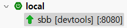
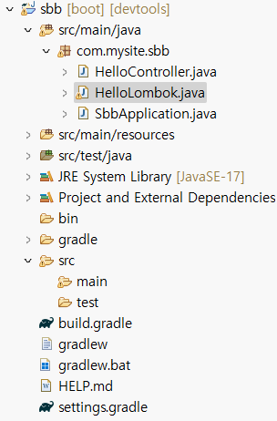
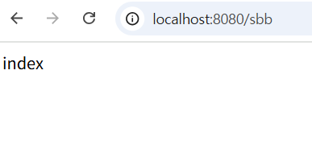
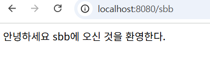
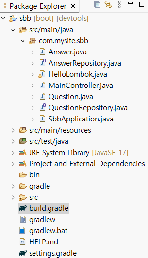
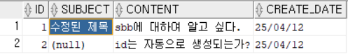
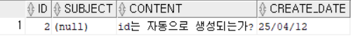
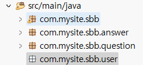

# 스프링 부트 개발 준비

## 스프링 부트란?

스프링 부트는 웹 애플리케이션을 만들도록 도와주는 웹 프레임워크이다. 스프링 부트는 스프링 프레임워크에 톰캣이라는 서버를 내장하고 여러 편의 기능들을 추가하였다.

### 웹 프레임워크란?

쿠키나 세션 처리, 로그인/로그아웃 처리, 권한 처리, 데이터베이스 처리 등 웹 프로그램을 완성하기 위해 만들어야 하는 기능이 많다. 웹 프레임워크를 사용하면 이런 기능들을 일일이 만들 필요가 없다. 이미 프레임워크에 만들어져 있기 때문에 그 기능들을 익혀서 사용하기만 하면 된다.

### 스프링 부트를 배워야 하는 이유

#### 스프링 부트는 튼튼한 웹 프레임워크이다

스프링 부트는 보안면에서 우수하다. 예를 들어 SQL 인젝션, XSS, CSRF, 클릭재킹과 같은 보안 공격을 막아준다.

#### 스프링 부트는 WAS가 필요 없다

스프링 부트 대신 스프링만 사용하여 웹 애플리케이션을 개발한다면 실행할 수 있는 톰캣과 같은 WAS가 필요하다. 하지만 스프링 부트에는 톰캣 서버가 내장되어 있고 설정도 자동 적용되기 때문에 WAS에 대해서 전혀 신경 쓸 필요가 없다. 심지어 배포되는 jar 파일에도 톰캣 서버가 내장되어 실행되므로 서로 다른 WAS들로 인해 발생되는 문제들도 사라진다. 즉 프로젝트 패키지만 옮기면 내장 톰캣도 덩달아 옮겨진다.

## 스프링 부트 개발 환경 준비

### JDK 설치

### STS 설치

### STS 실행

### 스프링 부트 프로젝트 생성

## 스프링 부트 맛보기

### 웹 서비스는 어떻게 동작할까?

본격적으로 웹 프로그램을 만들며 스프링 부트를 맛보기 전에 웹 서비스의 동작 원리를 간단히 살펴본다. 로컬 호스트, 웹 서버, 포트 등이 무엇인지 개념을 익힌다.

#### 클라이언트와 서버 구조 이해하기

클라이언트와 서버의 관계는 아래 그림으로 쉽게 이해할 수 있다. 클라이언트는 자주 사용하는 브라우저(크롬, 사파리 등)를 말하고, 서버는 브라우저로 접속 가능한 원격 컴퓨터를 의미한다.

크롬 브라우저에서 서버에 요청을 보낼 때는 서버의 주소(IP 주소) 또는 서버의 주소를 대체할 수 있는 도메인명을 알아야 한다. 가까운 예로 브라우저 주소 창에 naver.com을 입력하면 네이버에서 운용하는 웹 서버가 호출되고 서버는 요청에 대한 응답을 브라우저에게 돌려준다. 즉, 웹 서버는 요청에 대한 응답으로 HTML 문서나 다른 리소스들을 브라우저에 표시한다.

#### IP 주소와 포트 이해하기

서버는 브라우저로 접속할 수 있는 웹 서비스뿐만 아니라 FTP, 이메일 서비스 등도 운용할 수 있다. 하지만 보통 서비스별로 다른 IP 주소를 사용하지는 않는다. 왜냐하면 포트로 이러한 서비스들을 구분할 수 있기 때문이다. 포트는 네트워크 서비스를 구분하는 번호로, 하나의 서버 주소에서 포트를 사용하여 매우 많은 서비스를 운용할 수 있는데, 대표적인 서비스의 종류는 다음과 같다.

| 프로토콜  | 서비스 내용                            | 포트 |
| --------- | -------------------------------------- | ---- |
| HTTP      | 웹 서비스                              | 80   |
| HTTPS     | SSL을 적용한 웹 서비스                 | 443  |
| FTP       | 파일 전송 서비스                       | 21   |
| SSH, SFTP | 보안이 강화된 TELNET(텔넷), FTP 서비스 | 22   |
| TELNET    | 원격 서버 접속 서비스                  | 23   |
| SMTP      | 메일 전송 서비스                       | 25   |

브라우저 주소 창에 naver.com 대신 naver.com:443을 입력해본다. 443dms HTTPS 서비스의 기본 포트 번호이므로 naver.com만 입력했을 때와 동일하게 동작하는 것을 확인할 수 있다.

#### localhost:8080 이해하기

이번에는 웹 개발에서 자주 등장하는 localhost:8080을 알아본다. localhost:8080에서 먼저 localhost(로컬 호스트)라는 도메인명은 127.0.0.1이라는 IP 주소를 의미하며, 127.0.0.1 IP 주소는 내 컴퓨터를 의미한다. 그리고 8080은 8080번 포트로 서비스를 운용한다는 의미이다. 정리하자면, localhost:8080는 내 컴퓨터(localhost)에 8080번 포트로 실행된 서비스를 의미하는 것이다.

### 컨트롤러 만들기

#### 컨트롤러란?

Spring MVC 아키텍처에서 **Controller(컨트롤러)**는 다음 역할을 담당한다.

> 사용자의 HTTP 요청을 받아서, 적절한 비즈니스 로직(서비스)을 호출하고, 처리 결과를 뷰(view)에 전달하는 역할.
>
> http://localhost:8080/hello와 같은 브라우저의 요청을 처리하려면 먼저 컨트롤러가 필요하다. 컨트롤러는 서버에 전달된 클라이언트의 요청을 처리하는 자바 클래스이다.

쉽게 말해 웹 브라우저 요청을 받아서 처리한 뒤, 어떤 HTML을 보여줄지 결정하는 **교통 정리 담당자**이다.

| 개념            | 설명                                                         |
| --------------- | ------------------------------------------------------------ |
| @Controller     | HTTP 요청을 받아 처리하는 클래스임을 나타냄                  |
| 역할            | 요청 라우팅, 모델 생성, 뷰 반환 담당                         |
| 동작 원리       | DispatcherServlet → HandlerMapping → Controller → ViewResolver |
| @ResponseBody   | 반환값을 뷰가 아닌 응답 본문에 직접 전달                     |
| @RestController | JSON 반환 전용 컨트롤러                                      |
| MVC 흐름        | Model - View - Controller 각 책임이 분리됨                   |

#### Spring MVC 흐름 요약

```
[요청] GET /users/1?verbose=true
   ↓
DispatcherServlet (모든 HTTP 요청이 처음으로 통과하는 중앙 서블릿)
   ↓
HandlerMapping → 어떤 Controller가 요청을 처리할지 찾아줌
   ↓
HandlerAdapter → 매핑된 메서드 실행
   ↓
@PathVariable / @RequestParam / @RequestBody 등으로 데이터 추출
   ↓
Model에 데이터 담음
   ↓
return "viewName"
   ↓
ViewResolver → viewName → HTML 어떤 템플릿(.html, .jsp 등)을 렌더링할지 결정함
   ↓
[응답] HTML 페이지 or JSON 응답
```

#### `@Controller` 어노테이션 설명

```java
package com.mysite.sbb;

import org.springframework.stereotype.Controller;
import org.springframework.web.bind.annotation.GetMapping;
import org.springframework.web.bind.annotation.ResponseBody;

@Controller
public class HelloController {
	@GetMapping("/hello")
	@ResponseBody
	public String hello() {
		return "Hello World";
	}
}
```

**※ 역할**

* 이 클래스를 Spring이 자동으로 **Bean으로 등록**하게 함
* **HTTP 요청을 처리하는 웹 컴포넌트**로 인식됨
* 내부적으로 `@Component`의 특수화된 버전이다. → 즉, **Component Scan**에 의해 등록됨

클래스명 위에 적용된 @Controller 어노테이션은 HelloController 클래스가 컨트롤러의 기능을 수행한다는 의미이다. 이 어노테이션이 있어야 스프링 부터 프레임워크가 컨트롤러로 인식한다.

hello 메서드에 적용된 @GetMapping("/hello") 어노테이션은 http://localhost:8080/hello URL 요청이 발생하면 hello 메서드가 실행됨을 의미한다. 즉, /hello URL과 hello 메서드를 매핑하는 역할을 한다. 이때 URL명과 메서드명이 동일할 필요는 없다. 즉 /hello URL일 때 메서드명을 hello가 아닌 hello2와 같이 써도 상관 없다.

또한 Get 방식의 URL 요청을 위해 GetMapping을 사용하고 Post 방식의 URL 요청을 위해서는 PostMapping을 사용한다. 그리고 @ResponseBody 어노테이션은 hello 메서드의 출력 결과가 문자열 그 자체임을 나타낸다. hello 메서드는 'Hello World' 문자열을 리턴하므로 결과로 'Hello World' 문자열이 출력된다.

**cf) : Get 방식과 Post 방식**

Get과 Post는 HTTP 프로토콜을 사용하여 데이터를 서버로 전송하는 주요 방식이다. 먼저, Get 방식은 데이터를 URL에 노출시켜 요청하며, 주로 서버에서 데이터를 조회하거나 읽기 위한 목적으로 사용한다. 반면, Post 방식은 데이터를 숨겨서 요청하므로 로그인 정보와 같은 민감한 데이터를 서버에 제출하거나 저장하는 목적으로 사용한다.

#### @`Controller` 어노테이션의 정의

```java
@Target(ElementType.TYPE)
@Retention(RetentionPolicy.RUNTIME)
@Documented
@Component  // 결국 Component다!
public @interface Controller {
}
```

**@Target(ElementType.TYPE)**

* 이 어노테이션은 **클래스, 인터페이스, 열거형 등 타입 선언부에만 사용할 수 있음**을 의미.

* `TYPE`은 클래스 레벨을 의미.
* → 즉, 메서드나 필드에는 사용할 수 없다. 오직 클래스 위에만.

**@Retention(RetentionPolicy.RUNTIME)**

* 이 어노테이션이 **런타임에도 살아있게 유지**된다는 뜻.

* 자바의 어노테이션은 보존 레벨에 따라 처리 방식이 달라진다.

  | Retention | 설명                                                  |
  | --------- | ----------------------------------------------------- |
  | SOURCE    | 컴파일러에서만 사용. class 파일에 없음                |
  | CLASS     | 컴파일된 class 파일에는 있으나, JVM은 무시            |
  | RUNTIME   | JVM이 런타임에서도 읽을 수 있음 (스프링은 이걸 쓴다.) |

​	그래서 Spring이 런타임에 리플렉션으로 `@Controller`를 감지할 수 있는 거야.

**@Documented**

* 자바 문서(javadoc)를 생성할 때 이 어노테이션도 문서에 포함되게 해 줌.

* 실무에선 눈에 잘 안 띄지만, 공식 문서에 자동 포함되도록 해줌.

**@Component**

* **스프링이 `@Controller`를 빈으로 등록하는 이유**는 `@Controller`가 결국 `@Component`를 포함하고 있기 때문이야.
* 즉, `@Controller`는 사실상 `@Component`의 특수한 버전일 뿐이야.
* Spring의 Component Scan은 `@Component`, `@Service`, `@Repository`, `@Controller` 전부를 찾음.

**※ 핵심 포인트**

* `@Component`를 포함하므로 Spring이 자동으로 메모리에 올림
* `DispatcherServlet`이 `@Controller`로 등록된 클래스만 HTTP 요청 핸들러로 인식

#### 어떻게 요청을 처리하나?

컨트롤러 메서드는 다음 어노테이션으로 요청을 처리한다.

**요청 매핑 관련 어노테이션**

| 어노테이션        | 설명                          | 예제                                                        | 비고                                 |
| ----------------- | ----------------------------- | ----------------------------------------------------------- | ------------------------------------ |
| `@RequestMapping` | URL + HTTP 메서드를 함께 매핑 | `@RequestMapping(value="/users", method=RequestMethod.GET)` | 모든 메서드(GET, POST 등) 다 지원    |
| `@GetMapping`     | GET 요청 전용 매핑            | `@GetMapping("/users")`                                     | `@RequestMapping(method=GET)`의 축약 |
| `@PostMapping`    | POST 요청 전용 매핑           | `@PostMapping("/users")`                                    | 폼 제출, JSON 등록 등                |
| `@PutMapping`     | PUT 요청 처리                 | `@PutMapping("/users/{id}")`                                | 리소스 전체 수정                     |
| `@DeleteMapping`  | DELETE 요청 처리              | `@DeleteMapping("/users/{id}")`                             | 리소스 삭제                          |

**요청 데이터 추출 관련 어노테이션**

| 어노테이션        | 설명                                  | 예제                                                    | 주의사항                                                     |
| ----------------- | ------------------------------------- | ------------------------------------------------------- | ------------------------------------------------------------ |
| `@PathVariable`   | URL 경로에 포함된 변수 추출           | `/users/{id}` → `@PathVariable Long id`                 | 경로 변수 이름과 파라미터 이름이 일치해야 함                 |
| `@RequestParam`   | URL 쿼리 파라미터 추출                | `/search?keyword=test` → `@RequestParam String keyword` | 기본값 설정 가능: `@RequestParam(defaultValue="1") int page` |
| `@RequestBody`    | 요청 본문(body) JSON → Java 객체 매핑 | `{ "title": "Hello" }` → `@RequestBody PostDto dto`     | 주로 REST API에서 사용                                       |
| `@RequestHeader`  | HTTP Header 값 추출                   | `@RequestHeader("User-Agent") String userAgent`         | 인증 헤더, 커스텀 헤더 읽을 때 유용                          |
| `@ModelAttribute` | 폼 데이터를 Java 객체로 매핑          | `@ModelAttribute UserForm form`                         | GET/POST 폼에서 주로 사용됨                                  |

**응답 처리 관련 어노테이션**

| 어노테이션        | 설명                            | 예제                                            | 특징                    |
| ----------------- | ------------------------------- | ----------------------------------------------- | ----------------------- |
| `@ResponseBody`   | 반환 값을 HTTP body에 직접 작성 | `@ResponseBody String hello()` → `hello`        | REST API에서 필수       |
| `@ResponseStatus` | HTTP 상태 코드 설정             | `@ResponseStatus(HttpStatus.CREATED)`           | 성공, 실패 코드 지정    |
| `@RestController` | `@Controller + @ResponseBody`   | `@RestController public class ApiController {}` | JSON 반환 전용 컨트롤러 |

**예외 처리 관련 어노테이션**

| 어노테이션              | 설명                       | 예제                                                         | 특징                                           |
| ----------------------- | -------------------------- | ------------------------------------------------------------ | ---------------------------------------------- |
| `@ExceptionHandler`     | 컨트롤러 내부 예외 처리    | `@ExceptionHandler(IllegalArgumentException.class)`          | 특정 예외에 대한 핸들링 메서드 지정            |
| `@RestControllerAdvice` | 전역 예외 처리             | `@RestControllerAdvice public class GlobalExceptionHandler {}` | 모든 컨트롤러에 적용 가능, JSON 형태 응답 가능 |
| `@ControllerAdvice`     | 전역 예외 처리 (HTML 뷰용) | `@ControllerAdvice public class ViewExceptionHandler {}`     | 뷰 기반 애플리케이션에 사용                    |

**컨트롤러 보조 구성요소**

| 구성요소          | 설명                            | 사용 예제                                       | 비고                                     |
| ----------------- | ------------------------------- | ----------------------------------------------- | ---------------------------------------- |
| `Model`           | 뷰에 데이터를 전달하는 객체     | `model.addAttribute("list", data)`              | HTML 뷰로 데이터 전달 시 사용            |
| `ViewResolver`    | 뷰 이름을 실제 파일로 연결      | `"index"` → `templates/index.html`              | prefix/suffix로 HTML 경로 조합           |
| `@Controller`     | HTML 뷰를 반환하는 컨트롤러     | `@Controller public class MyController {}`      | 내부적으로 `@Component` 포함             |
| `@RestController` | JSON 등을 반환하는 API 컨트롤러 | `@RestController public class ApiController {}` | 내부적으로 `@Controller + @ResponseBody` |


#### `@Controller` vs `@RestController`

| 어노테이션        | 설명                                            |
| ----------------- | ----------------------------------------------- |
| `@Controller`     | **뷰(View)**를 반환함 (HTML 렌더링)             |
| `@RestController` | **데이터(JSON)**를 반환함 (API 용도)            |
| 구성 차이         | `@RestController = @Controller + @ResponseBody` |

```java
// 일반 컨트롤러
@Controller
public class ViewController {
   @GetMapping("/")
   public String index() {
      return "index";  // 뷰 이름 반환 (index.html)
   }
}

// REST API 컨트롤러
@RestController
public class ApiController {
   @GetMapping("/api")
   public String hello() {
      return "hello";  // "hello" 라는 문자열을 그대로 응답
   }
}
```

#### `@Controller` 내부 동작 (깊은 레벨)

1. Spring 부트 시작 시, `@ComponentScan`에 의해 `@Controller` 클래스가 탐색됨.
2. `DispatcherServlet`이 HTTP 요청을 받음.
3. `HandlerMapping`이 URL과 일치하는 `@Controller`의 메서드를 찾음.
4. 찾은 메서드를 실행하고, `Model` 객체에 데이터를 담아 전달.
5. 반환한 문자열은 **뷰 이름**으로 처리되어 `ViewResolver`가 HTML을 렌더링.
6. 응답이 사용자에게 전달됨.

#### Controller의 정석 구성 예시

```java
@Controller
@RequiredArgsConstructor
@RequestMapping("/question")
public class QuestionController {

	private final QuestionService questionService;

	@GetMapping("/list")
	public String list(Model model) {
		List<Question> questions = questionService.getList();
		model.addAttribute("questionList", questions);
		return "question_list"; // templates/question_list.html 렌더링
	}
}
```


### 로컬 서버 실행

앞에서 작성한 HelloController가 브라우저의 요청을 제대로 처리하는지 확인하려면 먼저 로컬 서버를 실행해야 한다.

1. 로컬 서버는 다음과 같은 순서로 실행한다.
   1. 화면 왼쪽 하단에 Boot Dashboard가 보이지 않는다면 STS 상단의 툴바에서 [Boot Dashboard] 아이콘을 클릭한다.
   2. Boot Dashboard에서 'local' 왼쪽에 있는 아래 화살표를 클릭하면 'sbb'라는 프로젝트명이 보이면 마우스로 선택한다.
   3. 'sbb'를 선택하면 로컬 서버를 실행할 수 있는 버튼이 여러 개 활성화 되는데 그중에 가장 왼쪽에 있는 시작 버튼을 클릭해 서버를 실행한다.
2. 순서대로 진행했다면 로컬 서버가 실행되고 STS 콘솔 창에 로컬 서버가 8080 포트로 실행되었다는 메시지가 출력될 것이다.

### 브라우저로 확인

로컬 서버를 실행하였으니 이번에는 HelloController가 브라우저의 요청을 처리하는지 확인한다. 구글 크롬과 같은 브라우저를 실행하고 주소 창에 http://localhost:8080/hello를 입력한다.

## 스프링 부트 도구 설치하기

### Spring Boot Devtools 설치

Spring Boot Devtools 라이브러리를 STS에 추가한다. Spring Boot Devtools를 추가하면 서버를 매번 재시작하지 않고도 수정한 내용이 반영된다.

1. 앞에서 작성한 HelloController.java를 다음과 같이 수정한다.

   ```java
   package com.mysite.sbb;
   
   import org.springframework.stereotype.Controller;
   import org.springframework.web.bind.annotation.GetMapping;
   import org.springframework.web.bind.annotation.ResponseBody;
   
   @Controller
   public class HelloController {
   	@GetMapping("/hello")
   	@ResponseBody
   	public String hello() {
   		return "Hello SBB";
   	}
   }
   ```

   출력하는 문자열을 'Hello World'에서 'Hello SBB'로 변경했다. 하지만 이렇게 수정하고 http://localhost:8080/hello URL을 호출하면 여전히 'Hello World'가 출력된다. 왜냐면 이와 같이 프로그램이 변경되더라도 별도의 과정 없이는 로컬 서버가 변경된 클래스를 즉시 반영하지 않기 때문이다. 그래서 프로그램을 간단히 수정하더라도 변경된 사항을 확인하기 위해 매번 서버를 재시작해야 하므로 개발 과정이 꽤 번거롭다.

2. 이러한 문제를 해결하려면 Spring Boot Devtools를 설치해야 한다. Spring Boot Devtools를 설치하면 서버를 재시작하지 않아도 클래스를 변경할 때 서버가 자동으로 재가동된다. Spring Boot Devtools를 사용하려면 Spring Boot Devtools를 그레이들로 설치해야 한다. 다음과 같이 STS 화면 왼쪽에서 build.gradle 파일을 찾아 수정한다.

   ```
   ...
       
   dependencies {
   	implementation 'org.springframework.boot:spring-boot-starter-web'
   	testImplementation 'org.springframework.boot:spring-boot-starter-test'
   	testRuntimeOnly 'org.junit.platform:junit-platform-launcher'
   	developmentOnly 'org.springframework.boot:spring-boot-devtools'
   }
   
   ...
   ```

3. build.gradle 파일에 작성한 내용을 적용하려면 build.gradle 파일을 선택한 후 마우스 오른쪽 버튼을 눌러 Gradle - Refresh Gradle Project를 클릭하여 필요한 라이브러리를 설치한다.

4. 설치가 완료되면 Boot Dashboard의 서버명이 sbb에서 sbb [devtools]로 바뀐다.

   

5. 서버 재시작

6. 이제 Spring Boot Devtools가 적용되었으니 브라우저에서 다시 http://localhost:8080/hello를 호출한다. 서버를 재시작했으므로 'Hello SBB'가 출력된다. 서버 재시작 없이도 변경 사항이 적용되는지 확인하기 위해 출력할 문자열을 다음과 같이 다시 변경한다.

   ```java
   package com.mysite.sbb;
   
   import org.springframework.stereotype.Controller;
   import org.springframework.web.bind.annotation.GetMapping;
   import org.springframework.web.bind.annotation.ResponseBody;
   
   @Controller
   public class HelloController {
   	@GetMapping("/hello")
   	@ResponseBody
   	public String hello() {
   		return "Hello Spring Boot Board";
   	}
   }
   ```

7. 수정 사항이 잘 반영되었는지 http://localhost:8080/hello을 호출한다. 서버를 재시작하지 않아도 'Hello Spring Board'가 출력된다. 

### 롬복 설치

롬복 라이브러리는 소스 코드를 작성할 때 자바 클래스에 어노테이션을 사용하여 자주 쓰는 Getter 메서드, Setter 메서드, 생성자 등을 자동으로 만들어 주는 도구이다.

이제 SBB 프로그램을 만들면서 게시물과 관련된 데이터를 처리하기 위해 엔티티 클래스나 DTO 클래스 등을 사용해야 하는데 그러기 위해서는 먼저 이 클래스들의 속성값을 읽고 저장하는 Getter, Setter 메서드를 만들어야 한다. 물론 Getter, Setter 메서드를 직접 작성해도 되지만 롬복을 사용하면 좀 더 짧고 깔끔한 소스 코드를 만들 수 있다.

1. 롬복을 사용하려면 먼저 플러그인을 설치해야 한다. 다음 URL에서 롬복 플러그인을 내려받는다.

   ```
   https://projectlombok.org/download
   ```

2. 내려받은 lombok.jar 파일을 cmd 창에서 다음과 같이 설치한다. lombok.jar 파일이 있는 위치로 이동한 후, 다음 명령을 실행해야 한다. 여기서는 'Downloads' 폴더에 lombok.jar 파일이 있으므로, 다음과 같이 입력한다.

   ```
   java -jar lombok.jar
   ```

3. 설치 창이 떳다면 [Specify location]을 클릭해 롬복 플러그인을 사용할 IDE인 STS가 설치된 경로를 선택한다(이미 올바른 경로가 선택되어 있다면 이 과정은 생략해도 된다). 그다음 [Install/Update]를 클릭해 롬복 플러그인을 설치한다.

4. 설치가 성공적으로 완료되면 [Quit Installer]를 클릭해 설치 프로그램을 종료한다.

5. 만약 STS가 활성화되어 있다면 종료하고 다시 시작한 후 build.gradle 파일을 다음과 같이 수정한다.

   ```
   ...
   dependencies {
   	implementation 'org.springframework.boot:spring-boot-starter-web'
   	testImplementation 'org.springframework.boot:spring-boot-starter-test'
   	testRuntimeOnly 'org.junit.platform:junit-platform-launcher'
   	developmentOnly 'org.springframework.boot:spring-boot-devtools'
   	compileOnly 'org.projectlombok:lombok'
   	annotationProcessor 'org.projectlombok:lombok'
   }
   ...
   ```

   이와 같이 롬복 라이브러리를 설치하고 컴파일할 때 롬복 라이브러리가 적용되도록 코드를 추가했다.

#### 롬복으로 Getter, Setter 메서드 만들기

[com.mysite.sbb]에 마우스 오른쪽 버튼을 누르고 [New - Class]를 클릭해 HelloLombok 클래스를 만든다. 그리고 다음과 같이 소스 코드를 작성하여 롬복이 정상적으로 동작하는지 확인한다. 다음 코드를 작성했을 때 오류가 없어야 한다.

```java
package com.mysite.sbb;

import lombok.Getter;
import lombok.Setter;

@Getter
@Setter
public class HelloLombok {
	private String hello;
	private int lombok;
	
	public static void main(String[] args) {
		HelloLombok helloLombok = new HelloLombok();
		helloLombok.setHello("헬로");
		helloLombok.setLombok(5);
		
		System.out.println(helloLombok.getHello());
		System.out.println(helloLombok.getLombok());
	}
	
}
```

HelloLombok 클래스에 'hello', 'lombok' 이렇게 2개의 속성을 추가한 후 클래스명 바로 위에 @Getter, @Setter라는 어노테이션을 적용했더니 Getter와 Setter 메서드를 따로 작성하지 않아도 setHello, setLombok, getHello, getLombok 등의 메서드를 사용할 수 있게 되었다. 즉, 롬복을 활용하면 속성에 대한 Setter, Getter 메서드를 별도로 작성하지 않아도 된다.

#### 롬복으로 생성자 만들기

이와 같이 hello, lombok 속성에 final을 추가하고 @RequiredArgsConstructor 어노테이션을 적용하면 해당 속성을 필요로 하는 생성자가 롬복에 의해 자동으로 생성된다. 즉, 롬복을 활용하면 필요한 생성자를 자동으로 만들어 준다.

```java
package com.mysite.sbb;

import lombok.Getter;
import lombok.RequiredArgsConstructor;
import lombok.Setter;

@Getter
@Setter
@RequiredArgsConstructor
public class HelloLombok {

	private final String hello;
	private final int lombok;
	
	public static void main(String[] args) {
		HelloLombok helloLombok = new HelloLombok("헬로", 5);
		
		System.out.println(helloLombok.getHello());
		System.out.println(helloLombok.getLombok());
	}
	
}
```

# 스프링 부트의 기본 기능 익히기

## 스프링 부트 프로젝트의 구조 이해

sbb 프로젝트에 HelloController.java와 HelloLombok.java 파일을 생성하였다. 자바 파일을 생성하거나 그레이들 파일을 수정하면서 살펴보긴 했지만 지금보다 규모가 더 큰 프로젝트를 만들려면 프로젝트 구조를 자세히 알고 이해해야 한다. 이번에는 스프링 부트 프로젝트의 구조와 파일에 대해서 알아보자. 먼저, STS 화면 왼쪽에 있는 스프링 부트 프로젝트의 전체 구조부터 살펴본다.



### src/main/java 디렉터리 

자바 파일을 저장하는 공간이다.

#### com.mysite.sbb 패키지

이 패키지는 SBB의 자바 파일을 저장하는 공간이다. HelloController.java와 같은 스프링 부트의 컨트롤러, 폼과 DTO, 데이터베이스 처리를 위한 엔티티, 서비스 등의 자바 파일이 이 곳에 위치한다.

#### SbbApplication.java 파일

모든 프로그램에는 프로그램의 시작을 담당하는 파일이 있다. 스프링 부트로 만든 프로그램(스프링 부트 애플리케이션)에도 시작을 담당하는 파일이 있는데 그 파일이 바로 '프로젝트명 + Application.java' 파일이다. 스프링 부트 프로젝트를 생성할 때 프로젝트명으로 'sbb'라는 이름을 입력하면 다음과 같이 SbbApplication.java 파일이 자동으로 생성된다.

```java
package com.mysite.sbb;

import org.springframework.boot.SpringApplication;
import org.springframework.boot.autoconfigure.SpringBootApplication;

@SpringBootApplication
public class SbbApplication {

	public static void main(String[] args) {
		SpringApplication.run(SbbApplication.class, args);
	}

}
```

SbbApplication 클래스에는 반드시 @SpringBootApplication 애너테이션이 적용되어 있어야 한다. @SpringBootApplication 애너테이션을 통해 스프링 부트 애플리케이션을 시작할 수 있다.

### src/main/resources 디렉터리 

자바 파일을 제외한 HTML, CSS, JS, 환경 파일 등을 저장하는 공간이다.

cf) : 환경파일이란?

프로젝트의 설정 정보를 저장하는 파일이다.

#### templates 디렉터리

src/main/resources 디렉터리의 하위 디렉터리인 templates에는 템플릿 파일을 저장한다. 템플릿 파일은 자바 코드를 삽입할 수 있는 HTML 형식의 파일로, 스프링 부트에서 생성한 자바 객체를 HTML 형태로 출력할 수 있다. templates에는 SBB 게시판 서비스에 필요한 '질문 목록', '질문 상세' 등의 웹 페이지를 구성하는 HTML 파일을 저장한다.

#### static 디렉터리

static 디렉터리에는 sbb 프로젝트의 스타일시트(css 파일), 자바스크립트(js 파일) 그리고 이미지 파일(jpg 파일, png 파일 등) 등을 저장한다.

#### application.properties 파일

application.properties 파일은 sbb 프로젝트의 환경을 설정한다. sbb 프로젝트의 환경 변수, 데이터베이스 등의 설정을 이 파일에 저장한다.

### src/test/java 디렉터리

sbb 프로젝트에서 작성한 파일을 테스트하는 코드를 저장하는 공간이다. JUnit과 스프링 부트의 테스트 도구를 사용하여 서버를 실행하지 않은 상태에서 src/main/java 디렉터리에 작성한 코드를 테스트할 수 있다.

### build.gradle 파일

build.gradle은 그레이들이 사용하는 환경 파일이다. 그레이들은 그루비를 기반으로 한 빌드 도구로 Ant, Maven과 같은 이전 세대의 단점을 보완하고 장점을 취합하여 만들었다. build.gradle 파일에는 프로젝트에 필요한 플러그인과 라이브러리를 설치하기 위한 내용을 작성한다.

cf) : 그루비란?

그레이들 빌드 스크립트를 작성하는 데 사용하는 스크립트 언어이다.

cf) : 빌드 도구의 쓰임

소스 코드를 컴파일하고 필요한 라이브러리를 내려받을 때 사용한다. SBB 프로젝트를 완성하면 단 한 개의 jar 파일로 패키징하여 서버에 배포할 수 있는데 이때에도 역시 빌드 도구를 사용한다.

## 간단한 웹 프로그램 만들기

웹 브라우저에서 http://localhost:8080/sbb 페이지를 요청했을 때 '안녕하세요 sbb에 오신 것을 환영합니다.'라는 문자열을 출력하도록 만든다.

### URL 매핑과 컨트롤러

1. STS의 왼쪽 하단에 있는 Boot Dashboard에서 시작 버튼을 눌러 로컬 서버를 구동한다.

2. http://localhost:8080/sbb 페이지를 요청한다.

   아마 URL을 입력하면 오류를 알리는 화면이 등장한다. 여기서 404는 HTTP 오류 코드 중 하나로, 브라우저가 요청한 페이지를 찾을 수 없다는 의미이다. 즉, 스프링 부트 서버가 http://localhost:8080/sbb라는 요청을 해석할 수 없기 때문에 이와 같은 오류가 발생한 것이다.

   그렇다면 이러한 오류를 해결하기 위해 어떻게 해야 하는가? 컨트롤러를 작성하여 /sbb URL에 대한 매핑을 추가하면 해결할 수 있다. 브라우저와 같은 클라이언트의 페이지 요청이 발생하면 스프링 부트는 가장 먼저 컨트롤러에 등록된 URL 매핑을 찾고, 해당 URL 매핑을 발견하면 URL 매핑과 연결된 메서드를 실행한다.

### 컨트롤러 만들어서 URL 매핑하기

웹 브라우저와 같은 클라이언트의 요청이 발생하면 서버 역할을 하는 스프링 부트가 응답해야 한다. 그러기 위해서는 URL이 스프링 부트에 매핑되어 있어야 하고 이를 위해서는 먼저 컨트롤러를 만들어야 한다.

1. 컨트롤러를 작성하여 URL 매핑을 추가하기 위해 다음과 같이 src/main/java 디렉터리의 com.mysite.sbb 패키지에 MainController.java 파일을 작성한다.

   ```java
   package com.mysite.sbb;
   
   import org.springframework.stereotype.Controller;
   import org.springframework.web.bind.annotation.GetMapping;
   
   @Controller
   public class MainController {
   	@GetMapping("/sbb")
   	public void index() {
   		System.out.println("index");
   	}
   }
   ```

   MainController 클래스에 @Controller 어노테이션을 적용하면 MainController 클래스는 스프링 부트의 컨트롤러가 된다. 그리고 index 메서드의 @GetMapping 어노테이션은 요청된 URL(/sbb)과의 매핑을 담당한다. 브라우저가 URL을 요청하면 스프링 부트는 요청 페이지와 매핑되는 메서드를 찾아 실행한다.

   정리하자면, 스프링 부트는 웹 브라우저로부터 http://localhost:8080/sbb 요청이 발생하면 /sbb URL과 매핑되는 index 메서드를MainController 클래스에서 찾아 실행한다.

2. 다시 http://localhost:8080/sbb URL을 호출해 본다.

   이번에도 오류가 발생한다. 하지만 404가 아닌 500 오류 코드로 바뀐 것을 확인할 수 있다. 브라우저가 http://localhost:8080/sbb 요청했을 때 MainController 클래스의 index 메서드가 호출되긴 했지만 오류가 발생하였다. 원래 URL과 매핑된 메서드는 결괏값을 리턴해야 하는데 아무 값도 리턴하지 않아 이와 같은 오류가 발생한 것이다. 즉, 오류를 해결하려면 클라이언트(브라우저)로 응답을 리턴해야 한다.

3. 다음과 같이 MainController.java를 수정한다.

   ```java
   package com.mysite.sbb;
   
   import org.springframework.stereotype.Controller;
   import org.springframework.web.bind.annotation.GetMapping;
   import org.springframework.web.bind.annotation.ResponseBody;
   
   @Controller
   public class MainController {
   	@GetMapping("/sbb")
   	@ResponseBody
   	public String index() {
   		return "index";
   	}
   }
   ```

   응답으로 'index'라는 문자열을 브라우저에 출력하기 위해 index 메서드의 리턴 자료형을 String으로 변경하고 문자열 'index'를 리턴했다. 여기서 @ResponseBody 어노테이션은 URL 요청에 대한 응답으로 문자열을 리턴하라는 의미로 쓰였다.

4. 오류가 해결되었다.

   

5. 이번에는 MainController.java를 수정하여 문자열 'index' 대신 '안녕하세요 sbb에 오신 것을 환영합니다.'를 출력한다.

   ```java
   package com.mysite.sbb;
   
   import org.springframework.stereotype.Controller;
   import org.springframework.web.bind.annotation.GetMapping;
   import org.springframework.web.bind.annotation.ResponseBody;
   
   @Controller
   public class MainController {
   	@GetMapping("/sbb")
   	@ResponseBody
   	public String index() {
   		return "안녕하세요 sbb에 오신 것을 환영한다.";
   	}
   }
   ```

6. 브라우저에 변경한 문자열이 잘 출력된다.

   

## JAP로 데이터베이스 사용하기

만들어 볼 SBB는 방문자들이 질문과 답변을 남길 수 있는 게시판 서비스이다. SBB 게시판의 사용자가 질문이나 답변을 작성하면 데이터가 생성되는데, 이러한 데이터를 관리하려면 저장, 조회, 수정하는 등의 기능을 구현해야 한다. 우리가 만들 SBB뿐만 아니라 대부분의 웹 서비스들은 생성되는 데이터를 관리하고 처리하기 위해 DB를 사용한다. DB는 데이터를 모으고 관리하는 저장소라고 할 수 있다.

여기서 문제는 DB를 관리하려면 SQL이라는 언어를 사용해야한다는 점이다. 스프링 부트와 달리 DB는 자바를 이해하지 못한다. 하지만 ORM(Object Relational Mapping)이라는 도구를 사용하면 자바 문법으로도 DB를 다룰 수 있다. 즉, ORM을 이용하면 개발자는 SQL을 직접 작성하지 않아도 DB의 데이터를 처리할 수 있다.

### ORM과 JPA 이해하기

#### ORM이란?

먼저, ORM에 대해 알아본다. 앞서 ORM은 SQL을 사용하지 않고 DB를 관리할 수 있는 도구라고 설명했다. ORM은 DB의 테이블을 자바 클래스로 만들어 관리할 수 있다. SQL의 쿼리문과 ORM 코드(즉, 자바로 작성된 코드)를 비교하여 ORM을 좀 더 이해해본다. 다음과 같은 'question'이란 이름의 테이블에 데이터를 입력한다고 가정한다. 그리고 question 테이블에는 id, subject, content라는 열이 있다고 가정한다.

| id   | subject | content    |
| ---- | ------- | ---------- |
| 1    | 안녕    | 인사드림   |
| 2    | 질문    | ORM이 궁금 |
| ...  | ...     | ...        |

이렇게 question 테이블에 데이터를 저장하려면 SQL 쿼리문은 다음과 같이 작성한다.

```sql
insert into question(id, subject, content) values (1, '안녕', '인사드림');
insert into question(id, subject, content) values (2, '질문', 'ORM이 궁금');
```

하지만 ORM을 사용하면 이러한 쿼리문 대신 자바 코드로 다음과 같이 작성할 수 있다.

```java
Question q1 = new Question();
q1.setId(1);
q1.setSubject("안녕");
q1.setContent("인사드림");
this.questionRepository.save(q1);

Question q2 = new Question();
q2.setId(2);
q2.setSubject("질문");
q2.setContent("ORM이 궁금");
this.questionRepository.save(q2);
```

이와 같이 SQL의 쿼리문과 ORM 코드를 단순히 비교하면 ORM 코드의 양이 더 많아 보이지만 별도의 SQL문을 사용하지 않아도 DB를 사용할 수 있기에 편리하다. ORM 코드를 살펴보면 Question은 자바 클래스이며, 이처럼 데이터를 관리하는 데 사용하는 ORM의 자바 클래스를 엔티티라고 한다. 엔티티는 DB의 테이블과 매핑되는 자바 클래스를 말한다.

ORM을 이용하면 MySQL, 오라클 DB, MS SQL과 같은 DBMS의 종류에 관계 없이 일관된 자바 코드를 사용할 수 있어서 프로그램을 유지보수하기가 편리하다. 또한 코드 내부에서 안정적인 SQL 쿼리문을 자동으로 생성해 주므로 개발자가 달라도 통일된 쿼리문을 작성할 수 있고, 오류 발생률도 줄일 수 있다.

#### JPA란?

스프링 부트는 JPA를 사용하여 DB를 관리한다. 스프링 부트는 JPA를 ORM의 기술 표준으로 사용한다. JPA는 인터페이스 모음이므로 이 인터페이스를 구현한 실제 클래스가 필요하다. JPA를 구현한 실제 클래스에는 대표적으로 하이버네이트가 있다. 

정리하자면, 하이버네이트는 JPA의 인터페이스를 구현한 실제 클래스이자 자바의 ORM 프레임워크로 스프링 부트에서 DB를 관리하기 쉽게 도와준다. 앞으로 만들어갈 SBB도 JPA와 하이버네이트 조합으로 DB를 관리한다.

### 데이터베이스 설치하기

JPA를 사용해 데이터를 관리하기 위해 먼저 DB를 설치한다. 

1. build.gradle 파일에 다음과 같이 dependencies를 추가한다.

   ```
   ...
   dependencies {
   	implementation 'org.springframework.boot:spring-boot-starter-web'
   	testImplementation 'org.springframework.boot:spring-boot-starter-test'
   	testRuntimeOnly 'org.junit.platform:junit-platform-launcher'
   	developmentOnly 'org.springframework.boot:spring-boot-devtools'
   	compileOnly 'org.projectlombok:lombok'
   	annotationProcessor 'org.projectlombok:lombok'
   	runtimeOnly 'com.oracle.database.jdbc:ojdbc11'
   }
   ...
   ```

   그 다음 build.gradle 파일을 선택한 후 마우스 오른쪽 버튼을 눌러 Gradle - Refresh Gradle Project를 클릭하여 필요한 라이브러리를 설치한다.

2. 설치한 DB를 사용하려면 src/main/resources 디렉터리의 application.properties 파일에 새로운 설정을 추가해야 한다. 다음과 같이 application.properties 파일을 작성한다.

   ```properties
   ...
   
   #DATABASE
   spring.datasource.url=jdbc:oracle:thin:@localhost:1521/XEPDB1
   spring.datasource.username=sbb
   spring.datasource.password=1234
   spring.datasource.driver-class-name=oracle.jdbc.OracleDriver
   
   ...
   ```

   * spring.datasource.url=jdbc:oracle:thin:@localhost:1521/orcl

     DB에 접속하기 위한 URL 경로이다.

     * jdbc

       DB 드라이버를 의미한다. 다른 드라이버(예를 들면 ODBC)를 사용한다면 해당 드라이버를 기입한다.

     * oracle

       사용하려는 DB가 Oracle임을 나타낸다.

     * thin

       Thin Driver를 사용한다는 것을 의미한다.

       Thin Driver는 Java로 작성된 경량 드라이버로, 네트워크를 통해 직접 DB 서버에 접속한다.

       클라이언트 쪽에 추가적인 네이티브 라이브러리를 설치하지 않아도 되는 장점이 있다.

     * @

       드라이버가 연결 정보(host, port, database)를 포함하는 부분이 시작된다는 것을 나타낸다.

     * localhost

       DB 서버의 호스트 이름 또는 IP 주소를 나타낸다.

       여기서는 `localhost`로 로컬 컴퓨터(자기 자신의 머신)를 가리킨다.

       원격 서버에 연결하려면 해당 서버의 IP 주소나 도메인 이름으로 바꿔야 한다.

     * 1521

       DB 서버의 포트 번호이다.

       다른 포트를 사용할 경우 해당 번호로 변경해야 한다.

     * orcl

       연결하려는 DB의 서비스 이름(Service Name) 또는 SID를 나타낸다.

       환경에 적합한 서비스 이름을 사용해야 한다.

   * spring.datasource.username=C##SCOTT

     DB 서버의 사용자 이름(계정)이다.

     C##은 Oracle 12d 부터 사용되는 구문 규칙이다.

   * spring.datasource.password=0000

     DB 서버의 사용자 패스워드이다.

   * spring.datasource.driver-class-name=oracle.jdbc.OracleDriver

     Oracle JDBC 드라이버 클래스 이름이다(oracle.jdbc.OracleDriver).

3. spring.datasource.url에 설정한 경로에 해당하는 DB 파일을 만들어야 한다. 스프링 부트에서 Oracle DB는 DB 경로를 따로 설정하지 않는다. 대신, Oracle DB에서 DB 경로를 직접 설정을 해야 한다.

### JPA 환경 설정하기

DB를 사용할 준비가 끝났다. 이제 자바 프로그램에서 DB를 사용할 수 있게 해야 한다. 자바 프로그램에서 DB에 데이터를 저장하거나 조회하려면 JPA를 사용해야 한다. 하지만 JPA를 사용하려면 먼저 준비 작업이 필요하다.

1. 다음처럼 build.gradle 파일을 수정한다.

   ```
   ...
   
   dependencies {
   	implementation 'org.springframework.boot:spring-boot-starter-web'
   	testImplementation 'org.springframework.boot:spring-boot-starter-test'
   	testRuntimeOnly 'org.junit.platform:junit-platform-launcher'
   	developmentOnly 'org.springframework.boot:spring-boot-devtools'
   	compileOnly 'org.projectlombok:lombok'
   	annotationProcessor 'org.projectlombok:lombok'
   	runtimeOnly 'com.oracle.database.jdbc:ojdbc11'
   	implementation 'org.springframework.boot:spring-boot-starter-data-jpa'
   }
   
   ...
   ```

   이전과 마찬가지로 build.gradle 파일을 선택한 후 마우스 오른쪽 버튼을 눌러 Gradle - Refresh Gradle Project를 클릭하여 변경 사항을 적용하면 JPA 라이브러리가 설치된다.

   cf) : implementation이란?

   build.gradle 파일에서 작성한 implementation은 필요한 라이브러리 설치를 위해 가장 일반적으로 사용하는 설정이다. implementation은 해당 라이브러리가 변경되더라도 이 라이브러리와 연관된 모든 모듈을 컴파일하지 않고 변경된 내용과 관련이 있는 모듈만 컴파일하므로 프로젝트를 리빌드하는 속도가 빠르다.

2. JPA 설정을 위해 이번에는 application.properties 파일을 다음과 같이 수정한다.

   ```properties
   ...
   
   #JPA
   spring.jpa.properties.hibernate.dialect=org.hibernate.dialect.OracleDialect
   spring.jpa.hibernate.ddl-auto=none
   spring.jpa.properties.hibernate.format_sql=true
   spring.jpa.properties.hibernate.show_sql=true
   
   ...
   ```

   추가한 설정 항목을 살펴본다.

   * spring.jpa.properties.hibernate.dialect

     스프링 부트와 하이버네이트를 함께 사용할 때 필요한 설정 항목이다. 표준 SQL이 아닌 하이버네이트만의 SQL을 사용할 때 필요한 항목으로 하이버네이트의 org.hibernate.dialect.Oracle21cDialect 클래스를 설정했다.

   * spring.jpa.hibernate.ddl-auto
   
     엔티티를 기준으로 데이터의 테이블을 생성하는 규칙을 설정한다.
   
   cf) : spring.jpa.hibernate.ddl-auto의 규칙을 더 알아본다.

   * none : 엔티티가 변경되더라도 데이터베이스를 변경하지 않는다.
   * update : 엔티티의 변경된 부분만 데이터베이스에 적용한다.
   * validate : 엔티티와 테이블 간에 차이점이 있는지 검사만 한다.
   * create : 스프링 부트 서버를 시작할 때 테이블을 모두 삭제한 후 다시 생성한다.
   * create-drop : create와 동일하지만 스프링 부트 서버를 종료할 때에도 테이블을 모두 삭제한다.
   
   개발 환경에서는 보통 update 모드를 사용하고, 운영 환경에서는 none 또는 validate를 주로 사용한다.

## 엔티티로 테이블 매핑하기

앞서 JPA로 DB를 사용할 준비를 마쳤다. JPA를 사용하려면 반드시 엔티티를 이해해야 한다. 그전에 DB의 구성 요소를 살펴보고 이어 엔티티에 대해 알아본다.

### 데이터베이스 구성 요소 살펴보기

### 엔티티 속성 구성하기

SBB에 사용할 엔티티를 만들어 보며 개념을 이해한다. 엔티티는 DB 테이블과 매핑되는 자바 클래스를 말한다. 우리가 만들고 있는 SBB는 질문과 답변을 할 수 있는 게시판 서비스이므로 SBB의 질문과 답변 데이터를 저장할 DB 테이블과 매핑되는 질문과 답변 엔티티가 있어야 한다.

※ 엔티티를 모델 또는 도메인 모델이라고도 한다. 여기에서는 이것을 구분하지 않고 테이블과 매핑되는 클래스를 모두 엔티티라 지칭한다.

그렇다면 먼저, 만들어야 할 질문(Question)과 답변(Answer) 엔티티에는 각각 어떤 속성들이 필요한지 생각한다. 우리가 만들려는 SBB 게시판은 사용자가 질문을 남기고 답변을 받을 수 있는 웹 서비스이다. 이와 같은 서비스를 제공하기 위해서는 사용자가 입력한 질문을 저장해야 하고, 질문의 제목과 내용을 담을 수 있는 항목이 필요하다. 그러므로 질문의 '제목'과 '내용' 등을 엔티티의 속성으로 추가해야 한다. 질문 엔티티에는 다음과 같은 속성이 필요하고, 이러한 엔티티의 속성은 테이블의 열과 매핑이 된다.

| 속성 이름  | 설명                      |
| ---------- | ------------------------- |
| id         | 질문 데이터의 고유 번호   |
| subject    | 질문 데이터의 제목        |
| content    | 질문 데이터의 내용        |
| createData | 질문 데이터를 작성한 일시 |

마찬가지로 답변 엔티티에는 다음과 같은 속성이 필요하다.

| 속성 이름  | 설명                      |
| ---------- | ------------------------- |
| id         | 답변 데이터의 고유 번호   |
| question   | 질문 데이터               |
| content    | 답변 데이터의 내용        |
| createData | 답변 데이터를 작성한 일시 |

이렇게 생각한 속성을 바탕으로 질문과 답변에 해당되는 엔티티를 작성한다.

### Question Entity

이 `Question` 클래스는 질문-답변 게시판 시스템에서 “**질문 하나**”를 표현하는 도메인 모델이며,
 **Oracle 데이터베이스의 QUESTION 테이블과 매핑**되도록 JPA 어노테이션으로 정의된 클래스이다.

*Question.java*

```java
package com.mysite.sbb;

import java.time.LocalDateTime;
import java.util.List;

import jakarta.persistence.CascadeType;
import jakarta.persistence.Column;
import jakarta.persistence.Entity;
import jakarta.persistence.GeneratedValue;
import jakarta.persistence.GenerationType;
import jakarta.persistence.Id;
import jakarta.persistence.OneToMany;
import jakarta.persistence.SequenceGenerator;
import lombok.Getter;
import lombok.Setter;

@Getter
@Setter
@Entity
public class Question {
	@Id
	@GeneratedValue(strategy = GenerationType.SEQUENCE, generator = "question_seq")
	@SequenceGenerator(name = "question_seq", sequenceName = "question_seq", allocationSize = 1)
	private Integer id;
	
	@Column(length = 200)
	private String subject;
	
	@Column(columnDefinition = "TEXT")
	private String content;
	
	private LocalDateTime createDate;
	
	@OneToMany(mappedBy = "question", cascade = CascadeType.REMOVE)
	private List<Answer> answerList;
}
```

#### 전체 구조 정리

| 필드명       | DB 컬럼 타입       | 설명                    | 어노테이션 요약                                |
| ------------ | ------------------ | ----------------------- | ---------------------------------------------- |
| `id`         | NUMBER (시퀀스)    | 질문 ID (PK, 자동 생성) | `@Id`, `@GeneratedValue`, `@SequenceGenerator` |
| `subject`    | VARCHAR2(200)      | 질문 제목               | `@Column(length=200)`                          |
| `content`    | CLOB               | 질문 본문 내용          | `@Lob`, `@Column`                              |
| `createDate` | TIMESTAMP          | 생성일시                | 자동 매핑                                      |
| `answerList` | 외래키 참조 컬렉션 | 여러 개의 답변 리스트   | `@OneToMany(mappedBy=..., cascade=...)`        |

#### 패키지 선언부

```java
package com.mysite.sbb;
```

* 이 클래스는 `com.mysite.sbb`라는 패키지에 소속돼 있음.

* Spring Boot에서는 패키지 구성이 매우 중요함. 기본적으로 `@SpringBootApplication`이 선언된 클래스보다 **하위 패키지에 있어야 컴포넌트 스캔에 포함**됨.

####  import 문

```java
import java.time.LocalDateTime;
```

* 자바 8부터 도입된 `java.time` 패키지의 날짜/시간 클래스.
* `LocalDateTime`은 날짜 + 시간 정보만 가짐 (타임존 없음).

```java
import java.util.List;
```

* 답변들을 리스트로 저장하기 위해 사용된 컬렉션 인터페이스.

* JPA에서 1:N 관계 매핑 시 자주 사용됨.

```java
import jakarta.persistence.*; // 여러 개 생략
```

* `jakarta.persistence`는 JPA 어노테이션을 제공하는 공식 패키지임.
* (예전에는 `javax.persistence`였지만 Jakarta EE로 넘어오면서 패키지 이름이 바뀜.)

```java
import lombok.Getter;
import lombok.Setter;
```

* 롬복 라이브러리 어노테이션.
* 해당 클래스의 모든 필드에 대해 **getter, setter 메서드 자동 생성**.

#### 클래스 선언부

```java
@Getter
@Setter
@Entity
public class Question {
```

* `@Getter` : `getId()`, `getSubject()` 등 메서드 자동 생성.
* `@Setter` : `setSubject(String subject)` 등 자동 생성.
* `@Entity` : 이 클래스는 JPA 엔티티이며, DB 테이블과 매핑됨.
  - 즉, 이 클래스는 **DB의 테이블 1개**를 의미함.
  - 기본적으로 클래스 이름을 소문자화한 `question`이라는 테이블로 매핑됨. (`@Table`로 바꿀 수 있음.)

#### id 필드

```java
@Id
@GeneratedValue(strategy = GenerationType.SEQUENCE, generator = "question_seq")
@SequenceGenerator(name = "question_seq", sequenceName = "question_seq", allocationSize = 1)
private Integer id;
```

* `@Id`: 이 필드가 기본키.

* `@GeneratedValue(...SEQUENCE...)` :

  - 오라클에서는 보통 **시퀀스를 통해 PK를 생성**하며, `IDENTITY` 전략은 권장되지 않음 (지원이 불완전하거나 성능 저하).
  - 생성값과 타입을 정함
  - `strategy = GenerationType.SEQUENCE` →
     Oracle에서는 **시퀀스를 통해 자동 생성**하겠다는 뜻이야.
  - `generator = "question_seq"` →
     **어떤 시퀀스 설정을 쓸지 지정** (→ 아래의 `@SequenceGenerator` 참조)

* `@SequenceGenerator` :

  ```JAVA
  @SequenceGenerator(
      name = "question_seq",               // JPA 내부에서 쓸 이름 (별칭)
      sequenceName = "QUESTION_SEQ",       // 실제 Oracle DB의 시퀀스 이름
      allocationSize = 1                   // JPA가 몇 개씩 미리 당겨쓸 건지
  )
  ```

  - 실제 DB에 존재하는 시퀀스와 연결.
  - 여기선 `question_seq`라는 이름의 시퀀스를 사용하고 있음.
  - 이 어노테이션은 **시퀀스를 직접 만들지 않음**.
  - 단지 JPA가 **"어떤 시퀀스를 어떻게 사용할지" 설정**하는 선언임.
  - `name` = JPA 내부에서 사용할 이름 (JPA가 이걸로 참조함)
  - `sequenceName` = 실제 Oracle DB에 존재하는 시퀀스 이름
  - `allocationSize` = JPA는 성능을 위해 **시퀀스를 매번 호출하지 않고**, **미리 여러 개의 ID 값을 확보(할당)** 해놓고 그걸 메모리에서 사용함.
    - 이때 `allocationSize = N`이면:
      - JPA는 시퀀스를 한 번 호출해서 **ID 값 N개를 예약**함.
      - 그리고 DB를 다시 접근하지 않고, **그 N개의 값을 차례대로 사용**함.
      - N개를 다 쓰면, 다음 번에 또 시퀀스를 호출해서 N개를 다시 확보함.

**오라클 SQL**

```SQL
CREATE SEQUENCE question_seq START WITH 1 INCREMENT BY 1;
```

#### subject 필드

```java
@Column(length = 200)
private String subject;
```

* `@Column(length = 200)` :

  - 해당 필드가 DB 테이블에서 `VARCHAR(200)`으로 생성됨.

  - 지정하지 않으면 기본값은 255자.

* 질문의 제목을 저장하는 필드.

#### content 필드

```java
@Column(columnDefinition = "CLOB")
private String content;
```

* 원래는 `@Column(columnDefinition = "TEXT")`처럼 썼을 텐데, **Oracle은 TEXT 타입이 없음!**
* 오라클에서 긴 텍스트는 **`CLOB`**로 저장해야 함.
* `@Lob` + `@Column` → JPA가 content 필드를 `CLOB` 타입으로 자동 매핑.

#### createDate 필드

```java
private LocalDateTime createDate;
```

* `LocalDateTime`은 JPA가 오라클에서 `TIMESTAMP` 타입으로 자동 매핑.
* 타임존 정보는 포함되지 않음.
* 오라클에서는 내부적으로 `TIMESTAMP(6)` 정도로 매핑됨.

#### answerList 필드

```java
@OneToMany(mappedBy = "question", cascade = CascadeType.REMOVE)
private List<Answer> answerList;
```

**관계 매핑 설명**

* `@OneToMany` : 하나의 질문은 여러 개의 답변을 가짐 → **1:N 관계**.

* `mappedBy = "question"` :

  - 이 필드는 **주 테이블이 아님.**
  - 실제 외래키는 `Answer` 테이블의 `question` 필드가 가지고 있음.

* `cascade = CascadeType.REMOVE` :

  - 질문이 삭제되면 연결된 답변들도 모두 자동 삭제됨.

  - 즉, **삭제 연쇄(연관 엔티티 자동 삭제)** 설정.

#### ※ 부가 설명

* `@Lob`은 텍스트 뿐 아니라 이미지(Blob)에도 사용됨.

  * **LOB**는 큰 데이터를 저장하기 위한 **상위 개념**.

  * 텍스트든, 이미지든, PDF든, **큰 데이터를 테이블 컬럼에 저장할 때** 쓰는 특수 타입.

  * Oracle에서는 LOB이 총 4종류로 나뉜다:

    | LOB 타입 | 의미                    | 저장 데이터                            |
    | -------- | ----------------------- | -------------------------------------- |
    | `BLOB`   | Binary Large Object     | 바이너리 데이터 (이미지, 영상, PDF 등) |
    | `CLOB`   | Character Large Object  | 일반 텍스트 (유니코드 X)               |
    | `NCLOB`  | National Character LOB  | 유니코드 텍스트 (`NVARCHAR` 기반)      |
    | `BFILE`  | Binary File (read-only) | DB 외부 파일 (파일 시스템 링크)        |

    | 타입    | 내용                    | 인코딩      | 최대 크기 | 사용 예시                        |
    | ------- | ----------------------- | ----------- | --------- | -------------------------------- |
    | `BLOB`  | 바이너리 데이터 저장    | 없음        | 4GB 이상  | 이미지, PDF, 영상 등             |
    | `CLOB`  | 대용량 텍스트           | 기본 문자셋 | 4GB 이상  | 게시글 본문, 문서 내용           |
    | `NCLOB` | 유니코드 대용량 텍스트  | UTF-16      | 4GB 이상  | 다국어 문서, 이모지 포함 글      |
    | `BFILE` | 외부 바이너리 파일 링크 | 없음        | OS 제한   | 대용량 영상/음원, 백업 파일 참조 |

  * 오라클에서 엔티티 이름과 컬럼 이름을 쌍따옴표 `" "`로 지정하면 대소문자 구분하니 주의.

* `allocationSize = 1`은 시퀀스 값 증가 간격을 JPA와 맞추기 위해 필요 (기본은 50인데, mismatch 발생 가능성 있음).

### Answer Entity

이 `Answer` 클래스는 질문-답변 게시판 시스템에서 “**답변 하나**”를 표현하는 도메인 모델이며,
 **Oracle 데이터베이스의 ANSWER 테이블과 매핑**되도록 JPA 어노테이션으로 정의된 클래스이다.

| 항목                                   | 설명                                  |
| -------------------------------------- | ------------------------------------- |
| `@Entity`                              | 이 클래스는 DB 테이블로 매핑됨        |
| `@Id`                                  | 기본키 식별자                         |
| `@GeneratedValue + @SequenceGenerator` | 오라클용 자동 증가 시퀀스 설정        |
| `@Column(columnDefinition = "CLOB")`   | 긴 텍스트 저장                        |
| `@ManyToOne`                           | 하나의 질문에 여러 개의 답변이 연결됨 |
| `@JoinColumn`                          | 외래 키 직접 지정                     |
| `LocalDateTime` → TIMESTAMP            | 날짜 및 시간 저장 가능                |

```java
package com.mysite.sbb;

import java.time.LocalDateTime;

import jakarta.persistence.Column;
import jakarta.persistence.Entity;
import jakarta.persistence.FetchType;
import jakarta.persistence.GeneratedValue;
import jakarta.persistence.GenerationType;
import jakarta.persistence.Id;
import jakarta.persistence.JoinColumn;
import jakarta.persistence.ManyToOne;
import jakarta.persistence.SequenceGenerator;
import lombok.Getter;
import lombok.Setter;

@Getter
@Setter
@Entity
public class Answer {
	@Id
	@GeneratedValue(strategy = GenerationType.SEQUENCE, generator = "answer_seq_gen")
	@SequenceGenerator(name = "answer_seq_gen", sequenceName = "answer_seq", allocationSize = 1)
	private Integer id;
	
	@Column(name = "content", columnDefinition = "CLOB", nullable = false)
	private String content;
	
	@Column(name = "createDate", nullable = false)
	private LocalDateTime createDate;
	
	@ManyToOne(fetch = FetchType.LAZY)
	@JoinColumn(name = "question_id", nullable = false)
	private Question question;
}

```

#### 패키지 및 import

```java
package com.mysite.sbb;
```

* `Answer` 클래스가 속한 패키지.
* 보통 도메인 단위 또는 기능별로 나누어 구조화함.

```java
import java.time.LocalDateTime;
```

* Java 8 이상의 `날짜 및 시간` API.
* DB의 `TIMESTAMP`와 1:1로 매핑 가능.

#### JPA 어노테이션 & Lombok

```java
@Getter
@Setter
```

* 롬복(Lombok) 어노테이션.
* 각각 `getX()`, `setX()` 메서드를 자동 생성해줌.
* 코드가 간결해짐.

```java
@Entity
```

* 이 클래스가 **JPA 관리 대상 엔티티**라는 선언.
* 즉, 이 클래스는 **DB의 테이블과 매핑**됨.
* 기본적으로 클래스명 `Answer` → 테이블명 `"ANSWER"`로 매핑됨 (Oracle은 대문자 자동 변환).
* 테이블명을 명시하고 싶으면 `@Table(name = "answer")` 같이 추가 가능.

#### ID 필드

```java
@Id
@GeneratedValue(strategy = GenerationType.SEQUENCE, generator = "answer_seq_gen")
@SequenceGenerator(name = "answer_seq_gen", sequenceName = "answer_seq", allocationSize = 1)
private Integer id;
```

| 요소                                 | 설명                                                  |
| ------------------------------------ | ----------------------------------------------------- |
| `@Id`                                | 이 필드가 **기본키**임을 나타냄                       |
| `@GeneratedValue(...)`               | 기본키 값이 자동 생성됨을 지정                        |
| `strategy = GenerationType.SEQUENCE` | Oracle에서는 `IDENTITY` 대신 `SEQUENCE`를 사용해야 함 |
| `generator = "answer_seq_gen"`       | 아래 `@SequenceGenerator`에서 정의한 이름과 연결됨    |
| `@SequenceGenerator(...)`            | 오라클의 시퀀스를 어떻게 사용할지 정의                |
| `sequenceName = "answer_seq"`        | 오라클에 존재하는 시퀀스 객체 이름 (수동 생성 필요함) |
| `allocationSize = 1`                 | 한 번에 1씩 증가 (Oracle과의 싱크 맞춤)               |

* 시퀀스 생성

  **주의**: Oracle DB에 `answer_seq`라는 시퀀스가 실제로 존재해야 함.

  ```sql
  CREATE SEQUENCE answer_seq START WITH 1 INCREMENT BY 1;
  ```

* @Id

  * 이 필드가 **기본키(PK)** 임을 선언.

  * DB에서 유일하게 식별할 수 있는 컬럼.

* @GeneratedValue(...)

  * 기본키 값이 자동으로 생성되도록 설정.

  * Oracle에서는 `IDENTITY`를 지원하지 않기 때문에 `SEQUENCE` 전략을 사용.

* @SequenceGenerator(...)

  * 시퀀스 사용 설정.

    | 속성               | 설명                                             |
    | ------------------ | ------------------------------------------------ |
    | `name`             | 이 클래스 내에서 사용할 이름                     |
    | `sequenceName`     | 실제 DB에 있는 Oracle 시퀀스 이름 (`answer_seq`) |
    | `allocationSize=1` | 시퀀스 값을 한 번에 하나씩 증가시킴              |

#### content 필드

```java
@Column(name = "content", columnDefinition = "CLOB", nullable = false)
private String content;
```

* @Column(...)

  * DB 컬럼의 속성을 지정.

  * 여기서는 `name`, `columnDefinition`, `nullable` 세 가지 설정.

    | 속성                        | 설명                                                         |
    | --------------------------- | ------------------------------------------------------------ |
    | `name = "content"`          | DB 컬럼명을 명시적으로 `content`로 지정                      |
    | `columnDefinition = "CLOB"` | 오라클에서는 긴 문자열을 저장할 때 `TEXT`가 아니라 `CLOB` 타입을 사용해야 함 |
    | `nullable = false`          | null 값을 허용하지 않음 (필수 입력 항목)                     |

#### createDate 필드

```java
@Column(name = "createDate", nullable = false)
private LocalDateTime createDate;
```

* 답변이 작성된 시간 저장용 필드.

* `LocalDateTime` → Oracle에서는 `TIMESTAMP`로 매핑됨.

* `nullable = false` → 이 값은 반드시 있어야 함.

| 요소                  | 설명                                                    |
| --------------------- | ------------------------------------------------------- |
| `name = "createDate"` | DB 컬럼명을 `createDate`로 설정                         |
| `nullable = false`    | 반드시 값이 있어야 함                                   |
| `LocalDateTime`       | 자바의 날짜/시간 API. 오라클에서는 `TIMESTAMP`로 저장됨 |

#### question 필드(외래 키, 관계 매핑)

```java
@ManyToOne(fetch = FetchType.LAZY)
@JoinColumn(name = "question_id", nullable = false)
private Question question;
```

* @ManyToOne

  * 이 필드가 **다대일(N:1) 관계**임을 나타냄.

  * 여러 개의 `Answer`가 하나의 `Question`에 달릴 수 있음.

* fetch = FetchType.LAZY

  * **지연 로딩 설정**.
  * `Answer`를 조회할 때 `Question`은 **즉시 불러오지 않고**, 실제 접근 시에만 불러옴.
  * 성능 최적화에 매우 중요함.

* @JoinColumn(...)

  * 이 필드를 DB에서 어떤 컬럼에 매핑할지 설정.

    | 속성                   | 설명                                 |
    | ---------------------- | ------------------------------------ |
    | `name = "question_id"` | 외래 키 컬럼명                       |
    | `nullable = false`     | 반드시 질문이 연결되어야만 저장 가능 |

  * 실제로는 `ANSWER` 테이블에 `QUESTION_ID`라는 컬럼이 생기고,

  * 이는 `QUESTION(ID)`를 참조하는 외래 키가 됨.

| 요소                                | 설명                                                         |
| ----------------------------------- | ------------------------------------------------------------ |
| `@ManyToOne`                        | 여러 개의 `Answer`가 하나의 `Question`에 속함 (N:1 관계)     |
| `fetch = FetchType.LAZY`            | 지연 로딩 설정. 실제 접근할 때만 `Question` 객체를 조회함 → 성능 최적화 |
| `@JoinColumn(name = "question_id")` | 외래 키 컬럼명을 명시적으로 `question_id`로 설정             |
| `nullable = false`                  | 반드시 `Question`과 연결되어야 함 (null 불가)                |

※ 이 설정에 의해 DB에 `QUESTION_ID` 컬럼이 생기고, `QUESTION` 테이블의 기본키와 외래 키 관계를 맺음.

#### 전체 테이블 생성 SQL 예시 (Oracle 기준)

```sql
CREATE TABLE ANSWER (
    ID NUMBER PRIMARY KEY,
    CONTENT CLOB NOT NULL,
    CREATE_DATE TIMESTAMP NOT NULL,
    QUESTION_ID NUMBER NOT NULL,
    CONSTRAINT FK_ANSWER_QUESTION FOREIGN KEY (QUESTION_ID) REFERENCES QUESTION(ID)
);

CREATE SEQUENCE answer_seq START WITH 1 INCREMENT BY 1;
```

#### 이 엔티티의 쓰임 예시 (서비스 코드에서)

```sql
Question q = questionRepository.findById(1L).orElseThrow();
Answer a = new Answer();
a.setContent("이것은 오라클에서 저장되는 답변입니다.");
a.setCreateDate(LocalDateTime.now());
a.setQuestion(q);
answerRepository.save(a);
```

## 리포지터리로 데이터베이스 관리하기

앞서 엔티티로 테이블을 구성하여 데이터를 관리할 준비를 마쳤다. 하지만 엔티티만으로는 테이블의 데이터를 저장, 조회, 수정, 삭제 등을 할 수 없다. 이와 같이 데이터를 관리하려면 데이터베이스와 연동하는 JPA 리포지터리가 반드시 필요하다.

#### 리포지터리의 역할

* 리포지터리는 **엔티티 객체(`Question`)와 데이터베이스 사이에서 중개 역할**
* 즉, `Question` 객체를 데이터베이스에 저장하거나, 불러오거나, 삭제하거나, 수정할 때 **직접 SQL을 작성하지 않아도** 되게 한다.
* **비즈니스 로직과 데이터 접근 로직을 분리**해서 코드 유지 보수성과 확장성을 높여주는 구조이다.

#### Spring Data JPA의 장점

* `JpaRepository`를 상속하면 수많은 기능이 자동으로 구현된다.
* 즉, **SQL 없이도 CRUD가 자동으로 제공**되며, 메서드 이름만 잘 지어도 조건 검색이 가능하다.

### 리포지터리 생성하기

#### QuestionRepository

```java
package com.mysite.sbb;

import org.springframework.data.jpa.repository.JpaRepository;

public interface QuestionRepository extends JpaRepository<Question, Long> {
}
```

##### 패키지 및 import

```java
package com.mysite.sbb;
```

* 이 파일이 소속된 패키지.
* 보통 Spring Boot 애플리케이션에서 루트 클래스가 `com.mysite.sbb`이면, 자동으로 이 패키지 아래 있는 모든 클래스들이 **컴포넌트 스캔** 대상이 돼서 자동 등록됨.
* 따라서 리포지터리를 이 위치에 두면 Spring이 감지하고 자동으로 사용할 준비를 마침.

```java
import org.springframework.data.jpa.repository.JpaRepository;
```

* Spring Data JPA에서 제공하는 **레포지터리 인터페이스의 슈퍼 클래스**를 가져온 것이다.
* 이걸 상속하면 CRUD, 페이징, 정렬 등 기본 기능을 다 사용할 수 있다.

##### QuestionRepository Interface

```java
public interface QuestionRepository extends JpaRepository<Question, Long> {
}
```

* `interface`: 클래스가 아니라 인터페이스이기 때문에, 직접 구현체를 만들 필요가 없다.
* `JpaRepository<Question, Long>`
  * Spring Data JPA가 제공하는 가장 강력한 기본 인터페이스.
  * 내부적으로는 `CrudRepository`, `PagingAndSortingRepository` 등을 상속받고 있어서 **모든 기본 기능을 내장**하고 있다.
  * 제네릭 타입 지정.
    - `Question` : 이 레포지터리가 다룰 **엔티티 클래스**
    - `Long` : 해당 엔티티의 **기본 키 타입**

##### QuestionRepository가 자동으로 제공하는 메서드들

| 메서드명         | 기능                             |
| ---------------- | -------------------------------- |
| `save(entity)`   | 엔티티 저장 또는 수정            |
| `findById(id)`   | ID로 엔티티 조회 (Optional 반환) |
| `findAll()`      | 모든 엔티티 목록 조회            |
| `delete(entity)` | 특정 엔티티 삭제                 |
| `count()`        | 총 개수 반환                     |
| `existsById(id)` | 존재 여부 확인                   |

이 외에도 아래처럼 메서드 기반 쿼리 메서드도 추가 가능하다.

```java
List<Question> findBySubject(String subject);
List<Question> findBySubjectLike(String pattern);
```

아래는 위 표의 리포지터리 메서드를 사용하는 예제이다.

* `save(entity)`

  ```java
  Question q = new Question();
  q.setSubject("JPA란?");
  q.setContent("Java Persistence API에 대해 질문합니다.");
  q.setCreateDate(LocalDateTime.now());
  
  questionRepository.save(q);
  ```

* `findById(id)`

  ```java
  Optional<Question> oq = questionRepository.findById(1L);
  if (oq.isPresent()) {
      Question q = oq.get();
      System.out.println(q.getSubject());
  }
  ```

  * 반환 타입이 `Optional<T>`인 이유:
     해당 ID가 없을 수도 있기 때문에.
  * `Optional`은 널 안전성을 제공함 (`.isPresent()`, `.orElse()` 등 사용 가능)

* `findAll()`

  ```java
  List<Question> questionList = questionRepository.findAll();
  for (Question q : questionList) {
      System.out.println(q.getId() + " / " + q.getSubject());
  }
  ```

  * `findAll()`은 테이블 내 전체 레코드를 `List`로 반환함.
  * 내부적으로는 `SELECT * FROM question`을 수행하는 것과 같음.

* `delete(entity)`

  ```java
  Optional<Question> oq = questionRepository.findById(1L);
  if (oq.isPresent()) {
      questionRepository.delete(oq.get());
  }
  ```

  * `delete()`는 해당 객체가 존재해야 함 (그래서 `findById()`로 먼저 찾음).
  * 내부적으로는 `DELETE FROM question WHERE id = ?`와 같음.

* `count()`

  ```java
  long total = questionRepository.count();
  System.out.println("총 질문 개수: " + total);
  ```

  * 내부적으로는 `SELECT COUNT(*) FROM question`과 같은 쿼리를 실행함.
  * 반환 타입은 `long`이야.

* `existsById(id)`

  ```java
  boolean exists = questionRepository.existsById(1L);
  System.out.println("ID 1이 존재하는가? " + exists);
  ```

  * 내부적으로는 `SELECT 1 FROM question WHERE id = ?` 같은 쿼리를 실행해.
  * 결과가 존재하면 `true`, 없으면 `false`를 반환함.

#### AnswerRepository

마찬가지로 Answer 리포지터리도 생성한다.

```java
package com.mysite.sbb;

import org.springframework.data.jpa.repository.JpaRepository;

public interface AnswerRepository extends JpaRepository<Answer, Long> {
}
```

### JUnit 설치하기

리포지터리를 이용하여 데이터를 저장하려면 질문을 등록하는 화면과 사용자가 입력한 질문 관련 정보를 저장하는 컨트롤러, 서비스 파일 등이 필요하다. 하지만 JUnit을 사용하면 이러한 프로세스를 따르지 않아도 리포지터리만 개별적으로 실행해 테스트해 볼 수 있다. 앞서 작성한 리포지터리가 정상적으로 동작하는지 직접 테스트하기 위해 먼저 JUnit을 설치한다.

※ JUnit은 테스트 코드를 작성하고, 작성한 테스트 코드를 실행할 때 사용하는 자바의 테스트 프레임워크이다. 사실 JUnit은 리포지터리뿐만 아니라 소프트웨어 개발 시 테스트 작업을 수행할 때 많이 사용한다.

JUnit을 사용하려면 build.gradle 파일에 다음과 같은 내용을 추가해야 한다.

```
...

dependencies {
	implementation 'org.springframework.boot:spring-boot-starter-web'
	testImplementation 'org.springframework.boot:spring-boot-starter-test'
	testRuntimeOnly 'org.junit.platform:junit-platform-launcher'
	developmentOnly 'org.springframework.boot:spring-boot-devtools'
	compileOnly 'org.projectlombok:lombok'
	annotationProcessor 'org.projectlombok:lombok'
	runtimeOnly 'com.oracle.database.jdbc:ojdbc11'
	implementation 'org.springframework.boot:spring-boot-starter-data-jpa'
	
	// JUnit 의존성
	testImplementation 'org.junit.jupiter:junit-jupiter'
	testRuntimeOnly 'org.junit.platform:junit-platform-launcher'
}

...
```

추가 후 Refresh Gradle Project를 선택하여 JUnit 설치를 마친다. JUnit을 사용할 준비가 된 것이다.

#### 질문 데이터 저장하기

질문 엔티티로 테이블을 만들었으니 이제 만들어진 테이블에 데이터를 생성하고 저장한다. 먼저, src/test/java 디렉터리의 com.mysite.sbb 패키지에 SbbApplicationTests.java 파일을 열어 본다.



#### SbbApplicationTests.java

먼저, 아래 Test 코드를 실행하기 위해 DB SQL 문을 작성한다.

```sql
DROP SEQUENCE question_seq;
DROP SEQUENCE answer_seq;

DROP TABLE ANSWER;
DROP TABLE QUESTION;

CREATE SEQUENCE question_seq START WITH 1 INCREMENT BY 1;
CREATE SEQUENCE answer_seq START WITH 1 INCREMENT BY 1;

CREATE TABLE QUESTION (
    ID NUMBER PRIMARY KEY,
    SUBJECT VARCHAR2(200),
    CONTENT CLOB,
    CREATE_DATE TIMESTAMP
);

CREATE TABLE ANSWER (
    ID NUMBER PRIMARY KEY,
    CONTENT CLOB NOT NULL,
    CREATE_DATE TIMESTAMP NOT NULL,
    QUESTION_ID NUMBER NOT NULL,
    CONSTRAINT FK_ANSWER_QUESTION FOREIGN KEY (QUESTION_ID) REFERENCES QUESTION(ID)
);


SELECT * FROM QUESTION;
SELECT * FROM ANSWER;

INSERT INTO QUESTION(ID, SUBJECT, CONTENT, CREATE_DATE) VALUES (question_seq.NEXTVAL, 'ASDF', 'ASDF', SYSTIMESTAMP);
INSERT INTO QUESTION(ID, SUBJECT, CONTENT, CREATE_DATE) VALUES (question_seq.NEXTVAL, 'sbb가 무어쉽니까?', 'ASDF', SYSTIMESTAMP);

commit;
```

아래 코드는 Spring Boot 프로젝트 내에서 `Question`이라는 엔티티를 저장하는 **JPA 기능을 테스트하는 JUnit 테스트 클래스**이다.

```java
package com.mysite.sbb.test.question;

import java.time.LocalDateTime;

import org.junit.jupiter.api.Test;
import org.springframework.beans.factory.annotation.Autowired;
import org.springframework.boot.test.autoconfigure.jdbc.AutoConfigureTestDatabase;
import org.springframework.boot.test.context.SpringBootTest;

import com.mysite.sbb.Question;
import com.mysite.sbb.QuestionRepository;

import jakarta.transaction.Transactional;

@SpringBootTest
@AutoConfigureTestDatabase(replace = AutoConfigureTestDatabase.Replace.NONE) // 오라클 사용!
@Transactional // 테스트 끝나면 자동으로 롤백됨
class SbbApplicationTests_sql_insert {
	
	@Autowired
	private QuestionRepository questionRepository;

	@Test
	void testJpa() {
		Question q1 = new Question();
		q1.setSubject("sbb가 무엇인가요?");
		q1.setContent("sbb에 대하여 알고 싶다.");
		q1.setCreateDate(LocalDateTime.now());
		this.questionRepository.save(q1);
		
		Question q2 = new Question();
		q2.setContent("스프링 부트 모델 질문");
		q2.setContent("id는 자동으로 생성되는가?");
		q2.setCreateDate(LocalDateTime.now());
		this.questionRepository.save(q2);
	}

}
```

#### @SpringBootTest

* 전체 Spring ApplicationContext를 로딩해서 테스트한다. 즉, **Spring Boot 환경 전체를 통합적으로 테스트**할 수 있는 환경을 만들어준다.
   → DI, JPA, Controller, Service 등 모든 스프링 구성 요소 사용 가능.
* 테스트 실행 시 **스프링 컨텍스트 전체**를 시작합니다.
* 이 애너테이션 덕분에, `@Autowired` 같은 의존성 주입이 작동합니다.
* `application.yml` 또는 `application.properties`에 설정된 DB도 연결되고, 실제 환경과 거의 동일하게 테스트 가능.

#### 클래스 선언

```java
class SbbApplicationTests {
```

* 테스트 클래스.
* 관례적으로 이름에 `Tests` 또는 `Test`를 붙임.

* DI (Dependency Injection)

#### DI (Dependency Injection)

```java
@Autowired
private QuestionRepository questionRepository;
```

* `QuestionRepository`는 `JpaRepository<Question, Integer>`를 상속한 인터페이스.
* Spring이 자동으로 구현체를 만들어 주입해줌.
* 덕분에 `questionRepository.save(...)`처럼 JPA를 사용할 수 있음.

#### @Test 애너테이션

```java
@Test
void testJpa() {
```

* 이 메서드는 테스트용 메서드임을 나타낸다.
* JUnit은 이 애너테이션이 붙은 메서드를 자동으로 실행한다.

#### 테스트 내용 (JPA 저장 로직)

```java
Question q1 = new Question();
q1.setSubject("sbb가 무엇인가요?");
q1.setContent("sbb에 대하여 알고 싶다.");
q1.setCreateDate(LocalDateTime.now());
this.questionRepository.save(q1);

Question q2 = new Question();
q2.setSubject("스프링 부트 모델 질문");
q2.setContent("id는 자동으로 생성되는가?");
q2.setCreateDate(LocalDateTime.now());
this.questionRepository.save(q2);
```

* `q1`이라는 `Question` 객체를 새로 생성한 후:
  - 제목(subject) 설정
  - 내용(content) 설정
  - 생성일자(LocalDateTime) 설정
  - `save()`를 통해 DB에 저장

​	※ `save()`는 Spring Data JPA의 기본 메서드로, 내부적으로는 `EntityManager.persist()`나 `merge()`가 동작한다.

#### ※  JUnit이 중요한 이유

1. **버그 사전 예방**: 코드의 이상 여부를 미리 파악 가능
2. **자동화된 회귀 테스트**: 수동 테스트 없이 전체 기능 검증 가능
3. **리팩토링 안전성 확보**: 구조 바꿔도 기존 기능이 잘 작동하는지 확인 가능
4. **개발 생산성 향상**: 반복적인 테스트를 자동화

#### ※ 추가 개념 정리 (필요하면 확장 가능)

| 개념                        | 설명                             |
| --------------------------- | -------------------------------- |
| `@BeforeEach`, `@AfterEach` | 각 테스트 전후로 실행되는 메서드 |
| `@BeforeAll`, `@AfterAll`   | 테스트 전체 전/후 실행           |
| `assertEquals(a, b)`        | `a == b`인지 확인                |
| `@Transactional`            | 테스트 후 DB 자동 롤백           |
| `@DataJpaTest`              | JPA 레이어만 슬림하게 테스트     |

##### `@BeforeEach`, `@AfterEach`, `@BeforeAll`, `@AfterAll`

```java
import org.junit.jupiter.api.*;
import java.time.LocalDateTime;

@TestInstance(TestInstance.Lifecycle.PER_CLASS) // static 없이 @BeforeAll 사용하기 위해 필요
@SpringBootTest
public class LifecycleTest {

    @BeforeAll
    void beforeAll() {
        System.out.println("테스트 전체 시작 전 실행");
    }

    @BeforeEach
    void beforeEach() {
        System.out.println("각 테스트 실행 전");
    }

    @Test
    void testExample1() {
        System.out.println("테스트 1 실행");
    }

    @Test
    void testExample2() {
        System.out.println("테스트 2 실행");
    }

    @AfterEach
    void afterEach() {
        System.out.println("각 테스트 실행 후");
    }

    @AfterAll
    void afterAll() {
        System.out.println("테스트 전체 종료 후 실행");
    }
}

```

##### `assertEquals`

```java
import static org.junit.jupiter.api.Assertions.assertEquals;

@Test
void testAddition() {
    int result = 2 + 3;
    assertEquals(5, result, "2 + 3 은 5여야 한다.");
}
```

##### `@Transactional` – 테스트 후 DB 자동 롤백

```java
import org.springframework.transaction.annotation.Transactional;

@Transactional
@SpringBootTest
public class TransactionalTest {

    @Autowired
    private QuestionRepository questionRepository;

    @Test
    void testSaveAndRollback() {
        Question q = new Question();
        q.setSubject("롤백 테스트");
        q.setContent("이 테스트는 끝나고 DB에 저장되지 않아야 합니다.");
        q.setCreateDate(LocalDateTime.now());

        questionRepository.save(q);

        // 저장 여부 확인 (테스트에서는 assert로 검증 가능)
        Question result = questionRepository.findById(q.getId()).orElse(null);
        assertEquals("롤백 테스트", result.getSubject());
    }

    // 테스트 끝나면 트랜잭션 롤백되므로 DB에 남지 않음
}
```

##### ※ 테스트에서 `@Transactional`이 하는 일

Spring Boot에서 테스트할 때 `@Transactional`을 붙이면,
 **테스트 메서드가 끝난 뒤 자동으로 DB 트랜잭션을 롤백한다.**

즉,

- `save()`, `delete()`, `update()` 같은 DB 조작을 하더라도
- 테스트 끝나면 실제 DB에는 **변경사항이 남지 않는다**

##### ※ 왜 롤백이 필요한가?

1. **테스트 데이터가 실제 DB를 오염시키지 않게 하기 위해서이다.**
2. 테스트는 여러 번 돌리니까, 남은 데이터가 있으면 다음 테스트에 영향을 줘서 문제가 생긴다.
3. 롤백을 안 하면 매번 insert → delete 코드까지 써야 하는데, 자동 롤백을 하면 편하다.

##### `@DataJpaTest` – 슬림한 JPA 레이어 테스트

```java
import org.springframework.boot.test.autoconfigure.orm.jpa.DataJpaTest;

@DataJpaTest // JPA 관련 빈만 로딩되고, 빠르게 동작
@AutoConfigureTestDatabase(replace = AutoConfigureTestDatabase.Replace.NONE)
public class QuestionRepositoryTest {

    @Autowired
    private QuestionRepository questionRepository;

    @Test
    void saveAndFind() {
        Question q = new Question();
        q.setSubject("DataJpaTest 예제");
        q.setContent("간단한 저장 및 조회");
        q.setCreateDate(LocalDateTime.now());
        questionRepository.save(q);

        Question result = questionRepository.findById(q.getId()).orElse(null);
        assertEquals("DataJpaTest 예제", result.getSubject());
    }
}
```

`@DataJpaTest`는 기본적으로 임시 DB **in-memory DB (H2)** 를 사용한다.

`application.yml`에서 H2 설정하거나 `@AutoConfigureTestDatabase(replace = Replace.NONE)`으로 실제 DB 사용도 가능.

| 요소                                     | 설명                                                         |
| ---------------------------------------- | ------------------------------------------------------------ |
| `@AutoConfigureTestDatabase`             | Spring Boot 테스트에서 사용할 **DB 자동 설정 방식을 정의**하는 애너테이션 |
| `replace = ...`                          | 어떤 경우에 테스트 DB를 **자동으로 교체(replace)할지** 결정하는 옵션 |
| `AutoConfigureTestDatabase.Replace.NONE` | "절대 교체하지 마!" → 즉, **기존 설정(application.yml)을 그대로 사용**하라는 뜻 |

#### 질문 데이터 조회하기

리포지터리가 제공하는 메서드들을 하나씩 살펴보고 이를 활요해 데이터를 조회한다.

```java
package com.mysite.sbb;

import static org.junit.jupiter.api.Assertions.assertEquals;

import java.util.List;
import java.util.Optional;

import org.junit.jupiter.api.Test;
import org.springframework.beans.factory.annotation.Autowired;
import org.springframework.boot.test.autoconfigure.jdbc.AutoConfigureTestDatabase;
import org.springframework.boot.test.context.SpringBootTest;

import jakarta.transaction.Transactional;

@SpringBootTest
@AutoConfigureTestDatabase(replace = AutoConfigureTestDatabase.Replace.NONE)
@Transactional
public class SbbApplicationTests_sql_select {
	
	@Autowired
	private QuestionRepository questionRepository;
	
	@Test
	void testJpa_findAll() {
		List<Question> all = this.questionRepository.findAll();
		assertEquals(2, all.size());
		Question q = all.get(0);
		assertEquals("sbb가 무엇인가요?", q.getSubject());
	}
	
	@Test
	void testJpa_findById() {
		Optional<Question> oq = this.questionRepository.findById(1L);
		if(oq.isPresent()) {
			Question q = oq.get();
			assertEquals("sbb가 무엇인가요?", q.getSubject());
		}
	}
	
}

```

##### findAll 메서드

```java
...
    
	@Test
	void testJpa() {
		List<Question> all = this.questionRepository.findAll();
		assertEquals(2, all.size());
		Question q = all.get(0);
		assertEquals("sbb가 무엇인가요?", q.getSubject());
	}

...
```

question 테이블에 저장된 모든 데이터를 조회하기 위해서 리포지터리(questionRepository)의 findAll 메서드를 사용했다. 앞서 2개의 질문 데이터를 저장했기 때문에 데이터 사이즈는 2가 되어야 한다. 데이터 사이즈가 2인지 확인하기 위해 JUnit의 assertEquals 메서드를 사용하는데, 이 메서드는 테스트에서 예상한 결과와 실제 결과가 동일한지를 확인하는 목적으로 사용한다. 즉, JPA 또는 DB에서 데이터를 올바르게 가져오는지를 확인하려는 것이다. 

assertEquals(기잿값, 실젯값)와 같이 작성하고 기댓값과 실젯값이 동일한지를 조사한다. 만약 기댓값과 실젯값이 동일하지 않다면 테스트는 실패로 처리된다. 여기서는 우리가 저장한 첫 번째 데이터의 제목이 'sbb가 무엇인가요?' 데이터와 일치하는지도 테스트했다. 테스트할 때 로컬 서버를 중지하고 다시 한번 Run - Run As - JUnit Test을 실행하면 테스트가 성공했다고 표시될 것이다.

##### findById 메서드

이번에는 질문 엔티티의 기본인 id의 값을 활용해 데이터를 조회한다.

```java
...
    
	@Test
	void testJpa_findById() {
		Optional<Question> oq = this.questionRepository.findById(1L);
		if(oq.isPresent()) {
			Question q = oq.get();
			assertEquals("sbb가 무엇인가요?", q.getSubject());
		}
	}

...
```

id값으로 데이터를 조회하기 위해서는 리포지터리의 findById 메서드를 사용해야 한다. 여기서 questionRepository를 사용하여 DB에서 id가 1인 질문을 조회한다. 이때 findById의 리턴 타입은 Question이 아닌 Optional임에 주의한다. findById로 호출한 값이 존재할 수도 있고, 존재하지 않을 수도 있어서 리턴 타입으로 Optional이 사용된 것이다.

Optional은 그 값을 처리하기 위한(null값을 유연하게 처리하기 위한) 클래스로, isPresent() 메서드로 값이 존재하는지 확인할 수 있다. 만약 isPresent()를 통해 값이 존재한다는 것을 확인했다면, get() 메서드를 통해 실제 Question 객체의 값을 얻는다. 즉, 여기서는 DB에서 ID가 1인 질문을 검색하고, 이에 해당하는 질문의 제목이 'sbb가 무엇인가요?'인 경우에 JUnit 테스트를 통과하게 된다.

##### findBySubject 메서드

이번에는 질문 엔티티의 subject값으로 데이터를 조회한다.

JpaRepository를 상속하면 다음처럼 기본적인 CRUD 메서드들은 자동으로 제공된다.

| 메서드              | 설명                 |
| ------------------- | -------------------- |
| `findById(Long id)` | ID로 조회            |
| `findAll()`         | 전체 목록 조회       |
| `save(entity)`      | 저장 (INSERT/UPDATE) |
| `delete(entity)`    | 삭제                 |

하지만 리포지터리는 findBySubject 메서드를 기본적으로 제공하지는 않는다. 그래서 findBySubject 메서드를 사용하려면 다음과 같이 QuestionRepository 인터페이스를 변경해야 한다. 

```java
package com.mysite.sbb;

import org.springframework.data.jpa.repository.JpaRepository;

public interface QuestionRepository extends JpaRepository<Question, Long> {
	Question findBySubject(String subject);
}
```

`JpaRepository`는 기본적으로 subject 같은 필드명으로 찾는 메서드는 제공하지 않는다.
대신, 메서드 이름만 선언하면, Spring Data JPA가 이름을 보고 자동으로 구현한다.

즉, findBy + 엔티티의 속성명(예를 들어 findBySubject)과 같은 리포지터리의 메서드를 작성하면 입력한 속성의 값으로 데이터를 조회할 수 있다.

이것이 바로 **쿼리 메서드(Query Method)** 기능이다.

다시 src/test/java 디렉터리로 돌아가 com.mysite.sbb 패키지의 SbbApplicationTests_sql_select.java를 수정해 subject 값으로 테이블에 저장된 데이터를 조회할 수 있다.

```java
package com.mysite.sbb;

import java.time.LocalDateTime;
import java.util.List;
import java.util.Optional;

import org.junit.jupiter.api.Test;
import org.springframework.beans.factory.annotation.Autowired;
import org.springframework.boot.test.context.SpringBootTest;

import static org.junit.jupiter.api.Assertions.assertEquals;

@SpringBootTest
class SbbApplicationTests {
	
	@Autowired
	private QuestionRepository questionRepository;

	@Test
	void testJpa() {
		Question q = this.questionRepository.findBySubject("sbb가 무엇인가요?");
		assertEquals(1, q.getId());
	}

}
```

findBySubject 메서드를 호출할 때 실제 DB에서는 어떤 쿼리문이 실행되는지 살펴본다. 실행되는 쿼리문은 콘솔 로그에서 확인할 수 있다. 그러기 위해 다음과 같이 application.properties 파일을 수정한다.

```properties
spring.application.name=sbb

#SERVER
server.port=8080

#DATABASE
spring.datasource.url=jdbc:oracle:thin:@localhost:1521/XEPDB1
spring.datasource.username=sbb
spring.datasource.password=1234
spring.datasource.driver-class-name=oracle.jdbc.OracleDriver

#JPA
spring.jpa.properties.hibernate.dialect=org.hibernate.dialect.OracleDialect
spring.jpa.hibernate.ddl-auto=none
spring.jpa.properties.hibernate.format_sql=true
spring.jpa.properties.hibernate.show_sql=true
```

1. 그리고 다시 한번 테스트 코드를 실행한다. 그러면 다음과 같이 콘솔 로그에서 DB에서 실행된 쿼리문을 확인할 수 있다.

   ```
   Hibernate: 
       select
           question_seq.nextval 
       from
           dual
   Hibernate: 
       select
           question_seq.nextval 
       from
           dual
   ```

   ```
   Hibernate: 
       select
           q1_0.id,
           q1_0.content,
           q1_0.create_date,
           q1_0.subject 
       from
           question q1_0 
       where
           q1_0.subject=?
   Hibernate: 
       select
           q1_0.id,
           q1_0.content,
           q1_0.create_date,
           q1_0.subject 
       from
           question q1_0
   Hibernate: 
       select
           q1_0.id,
           q1_0.content,
           q1_0.create_date,
           q1_0.subject 
       from
           question q1_0 
       where
           q1_0.id=?
   ```

   실행한 쿼리문 중 where 문에 조건으로 subject가 포함된 것을 확인할 수 있다.

##### findBySubjectAndContent 메서드

이번에는 subject와 content를 함께 조회한다. SQL을 활용해 DB에서 두 개의 열(여기서는 엔티티의 속성)을 조회하기 위해서는 And 연산자를 사용한다. subject와 content 속성을 조회하기 위해 findBySubject와 마찬가지로 리포지터리에 findBySubjectAndContent 메서드를 추가해야 한다. 다음과 같이 QuestionRepository.java 파일을 수정한다.

```java
package com.mysite.sbb;

import org.springframework.data.jpa.repository.JpaRepository;

public interface QuestionRepository extends JpaRepository<Question, Long> {
	Question findBySubject(String subject);
	Question findBySubjectAndContent(String subject, String content);
}
```

그리고 테스트 코드를 다음과 같이 작성한다.

```java
package com.mysite.sbb;

import static org.junit.jupiter.api.Assertions.assertEquals;

import java.util.List;
import java.util.Optional;

import org.junit.jupiter.api.Test;
import org.springframework.beans.factory.annotation.Autowired;
import org.springframework.boot.test.autoconfigure.jdbc.AutoConfigureTestDatabase;
import org.springframework.boot.test.context.SpringBootTest;

import jakarta.transaction.Transactional;

@SpringBootTest
@AutoConfigureTestDatabase(replace = AutoConfigureTestDatabase.Replace.NONE)
@Transactional
public class SbbApplicationTests_sql_select {
	
	@Autowired
	private QuestionRepository questionRepository;
	
	@Test
	void testJpa_findAll() {
		List<Question> all = this.questionRepository.findAll();
		assertEquals(2, all.size());
		Question q = all.get(0);
		assertEquals("sbb가 무엇인가요?", q.getSubject());
	}
	
	@Test
	void testJpa_findById() {
		Optional<Question> oq = this.questionRepository.findById(1L);
		if(oq.isPresent()) {
			Question q = oq.get();
			assertEquals("sbb가 무엇인가요?", q.getSubject());
		}
	}
	
	@Test
	void testJpa_findBySubject() {
		Question q = this.questionRepository.findBySubject("sbb가 무엇인가요?");
		assertEquals(1, q.getId());
	}
	
	@Test
	void testJpa_findBySubjectAndContent() {
		Question q = this.questionRepository.findBySubjectAndContent("sbb가 무엇인가요?", "sbb에 대해서 알고 싶습니다.");
		assertEquals(1, q.getId());
	}
	
}
```

```
Hibernate: 
    select
        q1_0.id,
        q1_0.content,
        q1_0.create_date,
        q1_0.subject 
    from
        question q1_0 
    where
        q1_0.subject=? 
        and q1_0.content=?
```

where 문에 and 연산자가 사용되어 subject와 content 열을 조회하는 것을 확인할 수 있다.

이렇듯 리포지터리의 메서드명은 데이터를 조회하는 쿼리문의 where 조건을 결정하는 역할을 한다. 여기서는 findBySubject, findBySubjectAndContent 두 메서드만 알아봤지만 상당히 많은 조합을 사용할 수 있다. 조합할 수 있는 메서드를 간단하게 표로 정리해 보았다.

| SQL 연산자       | 리포지터리의 메서드 예                                       | 설명                                                         |
| ---------------- | ------------------------------------------------------------ | ------------------------------------------------------------ |
| And              | findBySubjectAndContent(String subject, String content)      | Subject, Content 열과 일치하는 데이터를 조회                 |
| Or               | findBySubjectOrContent(String subject, String content)       | Subject열 또는 Content 열과 일치하는 데이터를 조회           |
| Between          | findByCreateDateBetween(LocalDateTime fromDate, LocalDateTime toDate) | CreateDate 열의 데이터 중 정해진 범위 내에 있는 데이터를 조회 |
| LessThan         | findByLessThan(Integer id)                                   | id 열에서 조건보다 작은 데이터를 조회                        |
| GreaterThanEqual | findByIdGreaterThanEqual(Integer id)                         | id 열에서 조건보다 크거나 같은 데이터를 조회                 |
| Like             | findBySubjectLike(String subject)                            | Subject 열에서 문자열 'subject'와 같은 문자열을 포함한 데이터를 조회 |
| In               | findBySubjectIn(String[] subjects)                           | Subject 열의 데이터가 주어진 배열에 포함되는 데이터만 조회   |
| OrderBy          | findBySubjectOrderByCreateDateAsc(String subject)            | Subject 열 중 조건에 일치하는 데이터를 조회하여 그 데이터를 반환할 때 CreateDate 열을 오름차순으로 정렬하여 반환 |

##### findBySubjectLike 메서드

이번에는 질문 엔티티의 subject 열 값들 중에 특정 문자열을 포함하는 데이터를 조회한다. SQL에서는 특정 문자열을 포함한 데이터를 열에서 찾을 때 Like를 사용한다. subject 열에서 특정 문자열을 포함하는 데이터를 찾기 위해 다음과 같이 findBySubjectLike 메서드를 리포지터리에 추가한다.

```java
package com.mysite.sbb;

import java.util.List;

import org.springframework.data.jpa.repository.JpaRepository;

public interface QuestionRepository extends JpaRepository<Question, Long> {
	Question findBySubject(String subject);
	Question findBySubjectAndContent(String subject, String content);
	List<Question> findBySubjectLike(String subject);
}
```

그리고 테스트 코드는 다음과 같이 수정한다.

```java
package com.mysite.sbb.test.question;

import static org.junit.jupiter.api.Assertions.assertEquals;

import java.util.List;
import java.util.Optional;

import org.junit.jupiter.api.Test;
import org.springframework.beans.factory.annotation.Autowired;
import org.springframework.boot.test.autoconfigure.jdbc.AutoConfigureTestDatabase;
import org.springframework.boot.test.context.SpringBootTest;

import com.mysite.sbb.Question;
import com.mysite.sbb.QuestionRepository;

import jakarta.transaction.Transactional;

@SpringBootTest
@AutoConfigureTestDatabase(replace = AutoConfigureTestDatabase.Replace.NONE)
@Transactional
public class SbbApplicationTests_sql_select {
	
	@Autowired
	private QuestionRepository questionRepository;
	
	@Test
	void testJpa_findAll() {
		List<Question> all = this.questionRepository.findAll();
		assertEquals(2, all.size());
		Question q = all.get(0);
		assertEquals("sbb가 무엇인가요?", q.getSubject());
	}
	
	@Test
	void testJpa_findById() {
		Optional<Question> oq = this.questionRepository.findById(1L);
		if(oq.isPresent()) {
			Question q = oq.get();
			assertEquals("sbb가 무엇인가요?", q.getSubject());
		}
	}
	
	@Test
	void testJpa_findBySubject() {
		Question q = this.questionRepository.findBySubject("sbb가 무엇인가요?");
		assertEquals(1, q.getId());
	}
	
	@Test
	void testJpa_findBySubjectAndContent() {
		Question q = this.questionRepository.findBySubjectAndContent("sbb가 무엇인가요?", "sbb에 대해서 알고 싶습니다.");
		assertEquals(1, q.getId());
	}
	
	@Test
	void testJpa_findBySubjectLike() {
		List<Question> qList = this.questionRepository.findBySubjectLike("sbb%");
		Question q = qList.get(0);
		assertEquals("sbb가 무엇인가요?", q.getSubject());
	}
	
}
```

findBySubjectLike 메서드를 사용할 때 데이터 조회를 위한 조건이 되는 문자열로 sbb%와 같이 %를 적어 주어야 한다. %는 표기하는 위치에 따라 의미가 달라진다. 아래 표를 살펴보자.

| 표기 예 | 표기 위치에 따른 의미   |
| ------- | ----------------------- |
| sbb%    | 'sbb'로 시작하는 문자열 |
| %sbb    | 'sbb'로 끝나는 문자열   |
| %sbb%   | 'sbb'를 포함하는 문자열 |

#### 질문 데이터 수정하기

질문 엔티티의 데이터를 수정하는 테스트 코드를 작성한다.

```java
package com.mysite.sbb.test.question;

import static org.junit.jupiter.api.Assertions.assertTrue;

import java.util.Optional;

import org.junit.jupiter.api.Test;
import org.springframework.beans.factory.annotation.Autowired;
import org.springframework.boot.test.autoconfigure.jdbc.AutoConfigureTestDatabase;
import org.springframework.boot.test.context.SpringBootTest;

import com.mysite.sbb.Question;
import com.mysite.sbb.QuestionRepository;

import jakarta.transaction.Transactional;

@SpringBootTest
@AutoConfigureTestDatabase(replace = AutoConfigureTestDatabase.Replace.NONE)
@Transactional
public class SbbApplicationTests_sql_update {
	
	@Autowired
	private QuestionRepository questionRepository;
	
	@Test
	void testJpa_setSubject() {
		Optional<Question> oq = this.questionRepository.findById(1L);
		assertTrue(oq.isPresent());
		Question q = oq.get();
		q.setSubject("수정된 제목");
		this.questionRepository.save(q);
	}
	
}
```

질문 엔티티의 데이터를 조회한 다음, subject 속성을 '수정한 제목'이라는 값으로 수정했다. 변경된 질문을 DB에 저장하기 위해서 this.questionRepository.sava(q)와 같이 리포지터리의 save 메서드를 사용했다.

테스트를 수행해 보면 다음과 같이 콘솔 로그에서 update 문이 실행되었음을 확인할 수 있다.

```
Hibernate: 
    select
        q1_0.id,
        q1_0.content,
        q1_0.create_date,
        q1_0.subject 
    from
        question q1_0 
    where
        q1_0.id=?
```

그리고 SELECT * FROM QUESTION 쿼리문을 입력하고 실행해 question 테이블을 확인하면 subject의 값이 변경되었음을 알 수 있다.



#### 질문 데이터 삭제하기

이어서 데이터를 삭제한다. 여기서는 첫 번째 질문을 삭제해 본다.

```java
package com.mysite.sbb.test.question;

import java.time.LocalDateTime;
import java.util.List;
import java.util.Optional;

import org.junit.jupiter.api.Test;
import org.springframework.beans.factory.annotation.Autowired;
import org.springframework.boot.test.context.SpringBootTest;

import com.mysite.sbb.Question;
import com.mysite.sbb.QuestionRepository;

import static org.junit.jupiter.api.Assertions.assertEquals;
import static org.junit.jupiter.api.Assertions.assertTrue;

@SpringBootTest
class SbbApplicationTests_sql_delete {
	
	@Autowired
	private QuestionRepository questionRepository;

	@Test
	void testJpa() {
		assertEquals(2, this.questionRepository.count());
		Optional<Question> oq = this.questionRepository.findById(1L);
		assertTrue(oq.isPresent());
		Question q = oq.get();
		this.questionRepository.delete(q);
		assertEquals(1, this.questionRepository.count());
	}

}
```

리포지터리의 delete 메서드를 사용하여 데이터를 삭제했다. 데이터 건수가 삭제하기 전에 2였는데, 삭제한 후 1이 되었는지를 테스트했다(리포지터리의 count 메서드는 테이블 행의 개수를 리턴한다).

그리고 다시 question 테이블을 확인해 보면 다음과 같이 ID가 1인 행이 삭제되었음을 알 수 있다.



#### 답변 데이터 저장하기

이번에는 답변 엔티티의 데이터를 생성하고 저장한다. SbbApplicationTests.java 파일을 열고 다음과 같이 수정한다.

```java
package com.mysite.sbb.test.answer;

import java.time.LocalDateTime;
import java.util.Optional;

import org.junit.jupiter.api.Test;
import org.springframework.beans.factory.annotation.Autowired;
import org.springframework.boot.test.context.SpringBootTest;

import com.mysite.sbb.Answer;
import com.mysite.sbb.AnswerRepository;
import com.mysite.sbb.Question;
import com.mysite.sbb.QuestionRepository;

import static org.junit.jupiter.api.Assertions.assertTrue;

@SpringBootTest
class SbbApplicationTests_sql_insert {
	
	@Autowired
	private QuestionRepository questionRepository;
	
	@Autowired
	private AnswerRepository answerRepository;

	@Test
	void testJpa() {
		Optional<Question> oq = this.questionRepository.findById(2L);
		assertTrue(oq.isPresent());
		Question q = oq.get();
		
		Answer a = new Answer();
		a.setContent("네 자동으로 생성됩니다.");
		a.setQuestion(q);
		a.setCreateDate(LocalDateTime.now());
		this.answerRepository.save(a);
	}

}
```

질문 데이터를 저장할 때와 마찬가지로 답변 데이터를 저장할 때에도 리포지터리(여기서는 AnswerRepository)가 필요하므로 AnswerRepository의 객체를 @Autowired를 통해 주입했다. 답변을 생성하려면 질문이 필요하므로 우선 질문을 조회해야 한다. questionRepository의 findById 메서드를 통해 id가 2인 질문 데이터를 가져와 답변의 question 속성에 대입해 답변 데이터를 생성했다.

DB에 값이 잘 들어갔는지 확인한다.


#### 답변 데이터 조회하기

답변 엔티티도 질문 엔티티와 마찬가지로 id 속성이 기본키이므로 값이 자동으로 생성된다. 질문 데이터를 조회할 때 findByID 메서드를 사용했듯이 id값을 활용해 데이터를 조회한다.

```java
package com.mysite.sbb.test.answer;

import static org.junit.jupiter.api.Assertions.assertEquals;
import static org.junit.jupiter.api.Assertions.assertTrue;

import java.util.Optional;

import org.junit.jupiter.api.Test;
import org.springframework.beans.factory.annotation.Autowired;

import com.mysite.sbb.Answer;
import com.mysite.sbb.AnswerRepository;
import com.mysite.sbb.QuestionRepository;

public class SbbApplicationTests_sql_select {
	
	@Autowired
	private QuestionRepository questionRepository;
	
	@Autowired
	private AnswerRepository answerRepository;
	
	@Test
	void testJpa() {
		Optional<Answer> oa = this.answerRepository.findById(1L);
		assertTrue(oa.isPresent());
		Answer a = oa.get();
		assertEquals(2, a.getQuestion().getId());
	}
	
}
```

id값이 1인 답변을 조회했다. 그리고 조회한 답변과 연결된 질문의 id가 2인지도 조회해 보았다.

#### 답변 데이터를 통해 질문 데이터 찾기 vs 질문 데이터를 통해 답변 데이터 찾기

앞에서 살펴본 답변 엔티티의 question 속성을 이용하면 다음과 같은 메서드를 사용해 '답변에 연결된 질문'에 접근할 수 있다.

```
a.getQuestion()
```

a는 답변 객체이고, a.getQuestion()은 답변에 연결된 질문 객체를 뜻한다.

답변에 연결된 질문 데이터를 찾는 것은 Answer 엔티티에 question 속성이 이미 정의되어 있어서 매우 쉽다.

그런데 반대의 경우도 가능할까? 즉, 질문 데이터에서 답변 데이터를 찾을 수 있을까? 다음과 같이 질문 엔티티에 정의한 answerList를 사용하면 해결할 수 있다.

```java
package com.mysite.sbb.test.answer;

import java.time.LocalDateTime;
import java.util.List;
import java.util.Optional;

import org.junit.jupiter.api.Test;
import org.springframework.beans.factory.annotation.Autowired;
import org.springframework.boot.test.context.SpringBootTest;

import com.mysite.sbb.Answer;
import com.mysite.sbb.AnswerRepository;
import com.mysite.sbb.Question;
import com.mysite.sbb.QuestionRepository;

import static org.junit.jupiter.api.Assertions.assertEquals;
import static org.junit.jupiter.api.Assertions.assertTrue;

@SpringBootTest
class SbbApplicationTests {
	
	@Autowired
	private QuestionRepository questionRepository;
	
	@Autowired
	private AnswerRepository answerRepository;

	@Test
	void testJpa() {
		Optional<Question> oq = this.questionRepository.findById(2L);
		assertTrue(oq.isPresent());
		Question q = oq.get();
		
		List<Answer> answerList = q.getAnswerList();
		
		assertEquals(1, answerList.size());
		assertEquals("네 자동으로 생성됩니다.", answerList.get(0).getContent());
	}

}
```

질문을 조회한 후 이 질문에 달린 답변 전체를 구하는 테스트 코드이다. id가 2인 질문 데이터에 답변 데이터를 1개 등록했으므로 이와 같이 코드를 작성해 확인할 수 있다.

왜냐하면 QuestionRepository가 findById 메서드를 통해 Question 객체를 조회하고 나면 **DB 세션이 끊어지기 때문**이다.

그래서 그 이후에 실행되는 q.getAnswerList() 메서드(Question 객체로부터 answer 리스트를 구하는 메서드)는 세션이 종료되어 오류가 발생한다. answerList는 앞서 q 객체를 조회할 때가 아니라 q.getAnswerList() 메서드를 호출하는 시점에 가져오기 때문에 이와 같이 오류가 발생한 것이다.

※ 이렇게 데이터를 필요한 시점에 가져오는 방식을 지연(Lazy) 방식이라고 한다. 이와 반대로 q 객체를 조회할 때 미리 answer 리스트를 모두 가져오는 방식은 즉시(Eager) 방식이라고 한다. @OneToMany, @ManyToOne 어노테이션 옵션으로 fetch-FetchType.LAZY 또는 fetch=FetchType.EAGER처럼 가져오는 방식을 설정할 수 있는데, 이 책에서는 따로 지정하지 않고 항상 디폴트값을 사용한다.

사실 이 문제는 테스트 코드에서만 발생한다. 실제 서버에서 JPA 프로그램들을 실행할 때는 DB 세션이 종료되지 않아 이와 같은 오류가 발생하지 않는다.

테스트 코드를 수행할 때 이런 오류를 방지할 수 있는 가장 간단한 방법은 다음과 같이 @Transactional 어노테이션을 사용하는 것이다. @Transactional 어노테이션을 사용하면 메서드가 종료될 때까지 DB 세션이 유지된다. 메서드에 @Transactional 어노테이션을 추가하면 오류 없이 잘 수행된다.

## 도메인별로 분류하기

이제 본격적으로 SBB의 외형을 갖춘다. 그전에 먼저, 지금까지 만든 많은 자바 파일을 정리하고 넘어간다. 현재는 자바 파일이 패키지별로 정리되어 있지 않아 어수선하다. 패키지를 활용하면 자바 파일을 원하는 대로 분류할 수 있다. 지금까지 우리가 작성한 파일은 오른쪽과 같이 com.mysite.sbb라는 이름의 패키지 안에 모두 모여 있다.

이렇게 하나의 패키지 안에 모든 자바 파일을 넣고 관리하는 것은 바람직하지 않다. 그러므로 SBB의 도메인별로 패키지를 나누어 자바 파일을 관리한다.

다음 표와 같이 SBB 프로젝트의 도메인별로 패키지를 구성하려고 한다.

| 도메인 이름 | 패키지 이름             | 설명                                  |
| ----------- | ----------------------- | ------------------------------------- |
| question    | com.mysite.sbb.question | 게시판의 질문과 관련된 자바 파일 모음 |
| answer      | com.mysite.sbb.answer   | 게시판의 답변과 관련된 자바 파일 모음 |
| user        | com.mysite.sbb.user     | 사용자와 관련된 자바 파일 모음        |

표와 같은 기준으로 STS에 직접 패키지를 생성하고 각 패키지에 맞도록 해당 파일들을 이동시킨다.

1. 패키지 생성을 위해 com.mysite.sbb 패키지를 선택한 후 마우스 오른쪽 버튼을 눌러 New - Package를 클릭한다. 그다음, New Java Package 창에서 com.mysite.sbb 다음에 패키지 이름을 입력하여 패키지를 만든다.

2. 패키지를 생성했다면 해당 패키지로 파일을 이동시킨다.

   com.mysite.sbb.question 패키지에 Question.java, QuestionRepository.java 파일을 이동시켰다. 이어서 com.mysite.sbb.answer 패키지를 생성하고 Answer.java, AnswerRepository.java 파일을 이동시켰다.

   이때 Answer.java에서 Question 클래스를 import하는 위치가 변경되므로 import com.mysite.sbb.question.Question; 문장을 추가해야 한다. Ctrl + Shift + O 키를 누르면 필요한 import 문을 쉽게 추가할 수 있다.

   그리고 나머지 파일들은 특정 도메인에 속하지 않았으므로 com.mysite.sbb 패키지에 그대로 놔두었다.

   이와 같이 자바 파일을 도메인에 따라 패키지로 나누어 관리하면 비슷한 기능이나 관련된 개념을 함께 묶어 코드들을 구조화하여 정리하게 되므로 코드를 쓰거나 읽을 때 혹은 유지 보수를 할 때 편리하다.

:rotating_light: 패키지명 확실히 기입할것([링크](https://www.inflearn.com/community/questions/95639/springboot%EC%97%90%EC%84%9C-controller%EB%A5%BC-%EB%AA%BB%EC%B0%BE%EB%8A%94-%EA%B2%83%EA%B0%99%EC%95%84%EC%9A%94-%EC%97%90%EB%9F%AC%EB%A9%94%EC%84%B8%EC%A7%80-%EC%97%86%EA%B3%A0-url%EC%A3%BC%EC%86%8C%EB%A1%9C-%EA%B0%80%EB%A9%B4-whitelabel-error-page%EA%B0%80-%EB%9C%B9%EB%8B%88%EB%8B%A4?srsltid=AfmBOopaPs90v9azL2qrcXPwX0duV9_lv9u_fnkXuxG70DA7D2Ex28DW))

* 스프링부트에서 컨트롤러를 실행하지 못하는 오류 발생

* SbbApplication.java가 자기 경로를 못찾아서 생긴 오류

* SbbApplication이 있는 곳과 같은 패키지 이거나 그 하위 패키지만 스프링 부트가 자동으로 컴포넌트 스캔을 해서 인식한다.

* 해서 패키지명을 스프링부트 네이밍 컨벤션에 맞추어서 기입해야 한다.

* 해결

  

## 질문 목록 만들기

SBB의 핵심 기능인 질문 목록이 담긴 페이지를 만든다.

현재 구상하고 있는 질문 목록은 다음 주소에 접속할 때 등장해야 한다.

```
http://localhost:8080/question/list
```

로컬 서버를 실행한 뒤, 웹 브라우저에서 해당 주소를 입력하여 접속한다. 현재는 404 오류 페이지가 나타난다.

### 질문 목록 URL 매핑하기

1. 앞서 등장한 404 오류를 해결하려면 /question/list URL을 매핑하기 위한 컨트롤러가 필요하다. 먼저, QuestionController.java 파일을 생성해 다음과 같이 작성한다. 이때 아까 만든 question 패키지 안에 QuestionController.java 파일을 생성한다.

   ```java
   package com.mysite.sbb.question;
   
   import org.springframework.stereotype.Controller;
   import org.springframework.web.bind.annotation.GetMapping;
   import org.springframework.web.bind.annotation.ResponseBody;
   
   @Controller
   public class QuestionController {
   
   	@GetMapping("/question/list")
   	@ResponseBody
   	public String list() {
   		return "question list";
   	}
   	
   }
   ```

2. 이렇게 입력하고 로컬 서버를 실행한 뒤, 다시 localhost:8080/question/list에 접속한다. 

### 템플릿 설정하기

앞서 문자열 'question list'를 직접 자바 코드로 작성하여 브라우저에 리턴했다. 하지만 보통 브라우저에 응답하는 문자열은 이 예처럼 자바 코드에서 직접 만들지 않는다. 일반적으로 많이 사용하는 방식은 템플릿 방식이다. 템플릿은 자바 코드를 삽입할 수 있는 HTML 형식의 파일을 말한다.

이러한 템플릿을 사용하기 위해 스프링 부트에서는 템플릿 엔진을 지원한다. 템플릿 엔진에는 Thymeleaf, Mustache, Groovy, Freemaker, Velocity 등이 있는데, 이 프로젝트에서는 스프링 진영에서 추천하는 타임리프 템플릿 엔진을 사용한다.

타임리프를 사용하려면 먼저 설치가 필요하다. 다음과 같이 build.gradle 파일을 수정하여 타임리프를 설치한다.

```
...

// Template Engine
implementation 'org.springframework.boot:spring-boot-starter-thymeleaf'
implementation 'nz.net.ultraq.thymeleaf:thymeleaf-layout-dialect'

...
```

### 템플릿 사용하기

템플릿을 사용할 수 있는 환경을 갖추었으니 이번에는 템플릿을 생성해 질문 목록 페이지를 만든다.

1. src/main/resources 디렉터리에서 templates를 선택한 후, question_list.html를 입력해서 템플릿을 생성한다.

2. question_list.html 파일의 내용을 다음과 같이 작성한다.

   ```html
   <h2>Hello Template</h2>
   ```

3. 다시 QuestionController.java 파일로 돌아가 다음과 같이 수정한다.

   ```java
   package com.mysite.sbb.question;
   
   import org.springframework.stereotype.Controller;
   import org.springframework.web.bind.annotation.GetMapping;
   import org.springframework.web.bind.annotation.ResponseBody;
   
   @Controller
   public class QuestionController {
   
   	@GetMapping("/question/list")
   	public String list() {
   		return "question_list";
   	}
   	
   }
   ```

   이제 템플릿을 사용하기 때문에 기존에 사용하던 @ResponseBody 어노테이션은 필요 없으므로 삭제한다. 그리고 list 메서드에서 question_list.html 템플릿 파일 이름인 'question_list'를 리턴한다.

4. 그리고 다시 로컬 서버를 실행한 뒤 localhost:8080/question/list에 접속하면 question_list.html 파일에 작성한 내용이 브라우저에 출력된다.

### 데이터를 템플릿에 전달하기

이제 질문 목록이 담긴 데이터를 조회하여 이를 템플릿을 통해 화면에 전달해 보려고 한다. 질문 목록과 관련된 데이터를 조회하려면 QuestionRepository를 사용해야 한다. QuestionRepository로 조회한 질문 목록 데이터는 Model 클래스를 사용하여 템플릿에 전달할 수 있다.

다음과 같이 QuestionController.java를 수정한다.

```java
package com.mysite.sbb.question;

import java.util.List;

import org.springframework.stereotype.Controller;
import org.springframework.web.bind.annotation.GetMapping;
import org.springframework.web.bind.annotation.ResponseBody;

import org.springframework.ui.Model;
import lombok.RequiredArgsConstructor;


@RequiredArgsConstructor
@Controller
public class QuestionController {

	private final QuestionRepository questionRepository;
	
	@GetMapping("/question/list")
	@ResponseBody
	public String list(Model model) {

		List<Question> questionList = this.questionRepository.findAll();

		model.addAttribute("questionList", questionList);

		return "question_list";
	}
	
}
```

@RequiredArgsConstructor 어노테이션의 생성자 방식으로 questionRepository 객체를 주입했다. @RequiredArgsConstructor는 롬복이 제공하는 어노테이션으로, final이 붙은 속성을 포함하는 생성자를 자동으로 만들어 주는 역할을 한다. 따라서 스프링 부트가 내부적으로 QuestionController를 생성할 때 롬복으로 만들어진 생성자에 의해 questionRepository 객체가 자동으로 주입된다.

그리고 QuestionRepository의 findAll 메서드를 사용하여 질문 목록 데이터인 questionList를 생성하고 Model 객체에 'questionList'라는 이름으로 저장했다. 여기서 Model 객체는 자바 클래스와 템플릿 간의 연결 고리 역할을 한다. Model 객체에 값을 담아 두면 템플릿에서 그 값을 사용할 수 있다. Model 객체는 따로 생성할 필요 없이 컨트롤러의 메서드에 매개변수로 지정하기만 하면 스프링 부트가 자동으로 Model 객체를 생성한다.

#### 전체 코드 분석

**`package` 선언**
 이 클래스가 속한 패키지를 나타냄.

```java
package com.mysite.sbb.question;
```

- 패키지명: `com.mysite.sbb.question`
- 보통 `com.회사명.프로젝트명.도메인` 형태.
- 이 구조로 패키지를 구분하면 기능 단위로 코드를 관리하기 쉬움.

**List 클래스 import**

```java
import java.util.List;
```

- `java.util` 패키지의 `List` 인터페이스를 가져옴.
- 여러 개의 질문(`Question`) 객체를 저장할 때 사용.

**Spring MVC Controller 지정 어노테이션**

```java
import org.springframework.stereotype.Controller;
```

* 이 클래스를 **웹 요청을 처리하는 컨트롤러**로 등록.
* 스프링이 이 클래스를 Bean으로 자동 등록하게 해줌.
* 내부적으로 `@Component`의 확장이다.

**HTTP GET 요청을 매핑할 때 사용되는 어노테이션**

```java
import org.springframework.web.bind.annotation.GetMapping;
```

* ex) `@GetMapping("/question/list")`는 `/question/list` URL에 대한 GET 요청을 처리.

**HTTP 응답 body에 직접 내용을 리턴하게 함**

```java
import org.springframework.web.bind.annotation.ResponseBody;
```

* 기본적으로 `@Controller`는 뷰 이름을 반환하지만,
* `@ResponseBody`를 붙이면 **문자열 자체나 객체가 그대로 응답 body로 반환**됨.

**스프링 MVC의 모델 객체**

```java
import org.springframework.ui.Model;
```

* 컨트롤러에서 뷰로 데이터를 넘겨줄 때 사용.
* 내부적으로 `request.setAttribute()`처럼 작동.

**Lombok 어노테이션**

```java
import lombok.RequiredArgsConstructor;
```

* `final`이 붙은 모든 필드를 매개변수로 갖는 **생성자**를 자동 생성.
* 즉, `private final QuestionRepository questionRepository;` 이 필드를 위한 생성자가 자동 생성됨.
* DI(의존성 주입)에 필요한 생성자를 손으로 만들 필요 없음.

#### 클래스 선언부

**클래스에 `@RequiredArgsConstructor`와 `@Controller`를 동시에 붙임**

```java
@RequiredArgsConstructor
@Controller
public class QuestionController {
```

- 이 클래스는 **웹 요청을 처리**하는 컨트롤러이며,

- 내부에서 사용되는 `final` 필드에 대해 생성자를 자동 생성해줌.

- 즉, `QuestionRepository`를 스프링이 자동으로 주입함.

#### 필드 선언

**의존성 주입 대상 필드**

```java
private final QuestionRepository questionRepository;
```

- `final`은 한 번 초기화되면 변경 불가능.

- 생성자 주입을 강제하기 위해 `final`로 선언.

- `@RequiredArgsConstructor`에 의해 자동 생성된 생성자에서 이 필드가 초기화됨.

- 실제 객체는 스프링이 관리하는 Bean에서 주입됨.

#### 핸들러 메서드

**HTTP GET 요청을 처리하는 메서드**

```java
@GetMapping("/question/list")
@ResponseBody
public String list(Model model) {
```

- URL: `/question/list`

- `@ResponseBody` → 반환값 `"question_list"`를 **그대로 브라우저에 문자열로 출력**함.

- 그런데 문제가 있음 → *실제로는 뷰 이름을 반환하려는 의도 같은데, `@ResponseBody` 때문에 뷰가 렌더링되지 않음.*

**DB에서 질문 리스트를 모두 조회**

```java
List<Question> questionList = this.questionRepository.findAll();
```

* JPA의 기본 메서드 `findAll()` 호출
* 결과는 `List<Question>` 타입
* 내부적으로 `SELECT * FROM question` 같은 쿼리가 실행됨

**조회한 데이터를 뷰로 전달**

```java
model.addAttribute("questionList", questionList);
```

- `Model` 객체에 `questionList`라는 이름으로 데이터 저장
- JSP, Thymeleaf 등 뷰 템플릿에서 `${questionList}`로 접근 가능

**뷰 이름 반환**

```java
return "question_list";
```

* `"question_list"`는 보통 `src/main/resources/templates/question_list.html` 같은 파일을 의미
* Thymeleaf 템플릿을 사용할 경우 이 파일이 렌더링됨

### 데이터를 화면에 출력하기

DB로부터 데이터를 조회하여 Model 객체에 저장하였고, 이제 Model 객체를 통해 전달받은 데이터들을 템플릿에서 활용할 준비를 마쳤다. 그렇다면 이제 질문 목록 데이터를 화면에 노출한다.

1. 이전에 입력한 내용을 지우고 다음과 같이 question_list.html 템플릿을 수정한다.

   ```html
   <table>
   	<thead>
   		<tr>			
   			<th>제목</th>
   			<th>작성일시</th>
   		</tr>
   	</thead>
   	<tbody>
   		<tr th:each="question : ${questionList}">
   			<td th:text="${question.subject}"></td>
   			<td th:text="${question.createDate}"></td>
   		</tr>
   	</tbody>
   </table>
   ```

   질문 목록을 HTML의 테이블 구조로 표시했다. 여기서 눈여겨볼 코드는 th:each="question:${questionList}"이다. 여기서 th:는 타임리프에서 사용하는 속성임을 나타내는데, 바로 이 부분이 자바 코드와 연결된다. question_list.html 파일에 사용한 타임리프 속성들을 살펴본다.

   ```html
   <tr th:each="question : ${questionList}">
   ```

   QuestionController의 list 메서드에서 조회한 질문 목록 데이터를 'questionList'라는 이름으로 Model 객체에 저장했다. 타임리프는 Model 객체에 저장한 questionList를 ${questionList}로 읽을 수 있다. 위의 코드는 questionList에 저장된 데이터를 하나씩 꺼내 question 변수에 대입한 후 questionList의 개수만큼 반복하며 `<tr> ... </tr>` 문장을 출력하라는 의미이다. 자바의 for each 문을 떠올리면 쉽게 이해할 수 있다.

   다음 코드는 question 객체의 subject를 `<td>` 태그로 출력한다.

   ```html
   <td th:text="${question.subject}"></td>
   ```

   다음 코드도 question 객체의 createDate를 출력한다.

   ```html
   <td th:text="${question.createDate}"></td>
   ```

2. 브라우저에 다시 localhost:8080/question/list에 접속한다.

cf) : 자주 사용하는 타임리프의 3가지 속성

타임리프의 여러 속성 중 다음 3가지 속성을 자주 사용한다. 이 3가지만 알아도 일반적인 화면을 만들기에 충분하다.

1. 분기문 속성

   if문, else if문과 같은 분기문은 다음과 같이 사용된다.

   ```
   th:if="${question != null}"
   ```

   이 경우 question 객체가 null이 아닌 경우에만 이 속성을 포함한 요소가 표시된다.

2. 반복문 속성

   th:each 반복문 속성은 자바의 for each 문과 유사하다.

   ```
   th:each="question : ${questionList}"
   ```

   반복문 속성은 다음과 같이 사용할 수도 있다.

   ```
   th:each="question, loop : ${questionList}"
   ```

   여기서 추가한 loop 객체를 이용하여 루프 내에서 다음과 같이 사용할 수 있다.

   * loop.index

     루프의 순서(루프의 반복 순서, 0부터 1씩 증가)

   * loop.count

     루프의 순서(루프의 반복 순서, 1부터 1씩 증가)

   * loop.size

     반복 객체의 요소 개수(예를 들어 questionList의 요소 개수)

   * loop.first

     루프의 첫 번째 순서인 경우 true

   * loop.last

     루프의 마지막 순서인 경우 true

   * loop.odd

     루프의 홀수 번째 순서인 경우 true

   * loop.even

     루프의 짝수 번째 순서인 경우 true

   * loop.current

     현재 대입된 객체(여기서는 question과 동일)

3. 텍스트 속성

   th:text=(속성)은 해당 요소의 텍스트값을 출력한다.

   ```
   th:text="${question.subject}"
   ```

   텍스트는 th:text 속성 대신에 다음처럼 대괄호를 사용하여 값을 직접 출력할 수 있다.

   ```html
   <tr th:each="question : ${questionList}">
   	<td>[[${question.subject}]]</td>
   	<td>[[${question.createDate}]]</td>    
   </tr>
   ```


## 루트 URL 사용하기

서버의 URL을 요청할 때 도메인명 뒤에 아무런 주소도 덧붙이지 않는 URL을 루트 URL이라고 한다. SBB 서비스에서 질문 목록을 메인 페이지로 정하고, 루트 URL을 요청했을 때 질문 목록 화면으로 이동되도록 만들어 보자. 즉, 웹 브라우저에서 http://localhost:8080/question/list 대신 루트 URL인 http://localhost:8080으로 접속해도 질문 목록 화면을 출력하도록 해보자.

현재 루트 URL를 매핑하지 않아서 브라우저에서 루트 URL에 접속하면 다음과 같은 404 오류 페이지가 나타난다.

루트 URL 호출 시 404 오류 페이지 대신 질문 목록 화면을 출력하기 위해 다음과 같이 MainController.java를 수정해 보자.

*MainController.java*

```java
package com.mysite.sbb;

import org.springframework.stereotype.Controller;
import org.springframework.web.bind.annotation.GetMapping;
import org.springframework.web.bind.annotation.ResponseBody;

@Controller
public class MainController {
	@GetMapping("/")
	@ResponseBody
	public String index() {
		return "안녕하세요 sbb에 오신 것을 환영한다.";
	}
	
	@GetMapping("/list")
	public String root() {
		return "redirect:/question/list";
	}
}
```

이와 같이 root 메서드를 추가하고 / URL을 매핑했다. 리턴 문자열 'redirect:/question/list'는 /question/list URL로 페이지를 리다이렉트하라는 명령어이다. 여기서 리다이렉트란 클라이언트가 요청하면 새로운 URL로 전송하는 것을 의미한다.

이제 http://localhost:8080 페이지에 접속하면 root 메서드가 실행되어 질문 목록이 표시되는 것을 확인할 수 있다.

## 서비스 활용하기

앞에서 질문 목록을 만들어 보았다. 이제 질문 목록에서 질문의 제목을 클릭하면 해당 질문과 관련된 상세 내용이 담긴 화면으로 넘어가게끔 하려고 한다. 하지만 그 전에 먼저 서비스란 무엇인지 알고 넘어가자.

우리는 그동안 QuestionController에서 QuestionRepository를 직접 접근해 질문 목록 데이터를 조회했다. 하지만 대부분의 규모 있는 스프링 부트 프로젝트는 컨트롤러에서 리포지터리를 직접 호출하지 않고 중간에 서비스를 두어 데이터를 처리한다. 이러한 서비스를 사용하여 SBB 프로그램을 개선해 보자.

### 서비스가 필요한 이유

서비스란 무엇일까? 서비스는 간단히 말해 스프링에서 데이터 처리를 위해 작성하는 클래스이다. 우리는 그동안 서비스 없이도 웹 프로그램을 동작시키는 데 문제가 없었다. 그런데 굳이 서비스를 사용해야 할까? 서비스가 필요한 이유를 좀 더 자세히 알아보자.

#### 복잡한 코드를 모듈화할 수 있다

예를 들어 A라는 컨트롤러가 어떤 기능을 수행하기 위해 C라는 리포지터리의 메서드 a, b, c를 순서대로 실행해야 한다고 가정해 보자. 그리고 B라는 컨트롤러도 A 컨트롤러와 동일한 기능을 수행해야 한다면 A, B 컨트롤러가 C 리포지터리의 메서드 a, b, c 메서드를 호출하는 기능을 서비스로 만들고 컨트롤러에서 이 서비스를 호출하여 사용할 수 있다. 즉, 서비스를 사용하면 이와 같은 모듈화가 가능하다.

#### 엔티티 객체를 DTO 객체로 변환할 수 있다

우리가 앞에서 작성한 Question, Answer 클래스는 모두 엔티티 클래스이다. 엔티티 클래스는 DB와 직접 맞닿아 있는 클래스이므로 컨트롤러 또는 타임리프와 같은 템플릿 엔진에 전달해 사용하는 것은 좋지 않다. 왜냐하면 엔티티 객체에는 민감한 데이터가 포함될 수 있는데, 타임리프에서 엔티티 객체를 직접 사용하면 민감한 데이터가 노출될 위험이 있기 때문이다.

이러한 이유로 Question, Answer 같은 엔티티 클래스는 컨트롤러에서 사용하지 않도록 설계하는 것이 좋다. 그래서 Question, Answer를 대신해 사용할 DTO 클래스가 필요하다. 그리고 Question, Answer 등의 엔티티 객체를 DTO 객체로 변환하는 작업도 필요하다. 그러면 엔티티 객체를 DTO 객체로 변환하는 일은 어디서 처리해야 할까? 이때도 서비스가 필요하다. 서비스는 컨트롤러와 리포지터리의 중간에서 엔티티 객체와 DTO 객체를 서로 변환하여 양방향에 전달하는 역할을 한다.

### 서비스 만들기

컨트롤러에서 리포지터리 대신 사용할 서비스를 만들어 보자. 먼저 src/main/java 디렉터리의 com.mysite.sbb.question 패키지에 QuestionService.java 파일을 만들어 다음과 같은 내용을 작성해 보자.

*/question/QuestionService.java*

```java
package com.mysite.sbb.question;

import java.util.List;

import org.springframework.stereotype.Service;

import lombok.RequiredArgsConstructor;

@RequiredArgsConstructor
@Service
public class QuestionService {
	
	private final QuestionRepository questionRepository;
	
	public List<Question> getList() {
		
		return this.questionRepository.findAll();
		
	}

}
```

생성한 클래스를 서비스로 만들기 위해서는 이와 같이 클래스명 위에 @Service 어노테이션을 붙이면 된다. @Controller, @Entity 등과 마찬가지로 스프링 부트는 @Service 어노테이션이 붙은 클래스는 서비스로 인식하므로 서비스를 쉽게 생성할 수 있다.

이 코드에서는 질문 목록 데이터를 조회하여 리턴하는 getList 메서드를 추가했다. getList 메서드의 내용을 살펴보면 컨트롤러(QuestionController)에서 리포지터리를 사용했던 부분을 그대로 옮긴 것을 알 수 있다.

### 컨트롤러에서 서비스 사용하기

QuestionController.java 파일로 돌아가 QuestionController가 리포지터리 대신 서비스를 사용하도록 다음과 같이 수정해 보자.

*/question/QuestionController.java*

```java
package com.mysite.sbb.question;

import java.util.List;

import org.springframework.stereotype.Controller;
import org.springframework.ui.Model;
import org.springframework.web.bind.annotation.GetMapping;

import lombok.RequiredArgsConstructor;

@RequiredArgsConstructor
@Controller
public class QuestionController {
	
	private final QuestionService questionService;

	@GetMapping("/question/list")
	public String list(Model model) {
		List<Question> questionList = this.questionService.getList():
		model.addAttribute("questionList", questionList);
		return "question_list";
	}
	
}
```

브라우저로 http://localhost:8080/question/list 페이지에 접속하면 리포지터리를 사용했을 때와 동일한 화면을 볼 수 있다.

앞으로 작성할 다른 컨트롤러도 이와 같이 리포지터리를 직접 사용하지 않고 컨트롤러 - 서비스 - 리포지터리 순서로 접근하는 과정을 거쳐 데이터를 처리할 것이다. 

## 상세 페이지 만들기

이번 절에서는 다음과 같이 질문 목록에서 질문의 제목을 클릭하면 해당 질문과 관련된 상세 내용이 담긴 페이지로 넘어가게끔 기능을 추가해 보자.

### 질문 목록에 링크 추가하기

먼저, 질문 목록의 제목을 클릭하면 상세 화면이 호출되도록 제목에 링크를 추가하자. 다음과 같이 질문 목록 템플릿인 question_list.html을 수정해 보자.

*/templates/question_list.html*

```html
<table>
	<thead>
		<tr>			
			<th>제목</th>
			<th>작성일시</th>
		</tr>
	</thead>
	<tbody>
		<tr th:each="question, index : ${questionList}">
			<td>
				<a th:href="@{|/question/detail/${question.id}|}" th:text="${question.subject}"></a>
			</td>
			<td th:text="${question.createDate}"></td>
		</tr>
	</tbody>
</table>
```

`<td>` 태크를 통해 질문 목록의 제목을 텍스트로 출력하던 것에서 질문의 상세 내용이 담긴 웹페이지로 이동할 수 있는 링크로 변경했다.

제목에 상세 페이지 URL을 연결하기 위해 타임리프의 th:href 속성을 사용한다. 이때 URL은 반드시 @{와 } 문자 사이에 입력해야 한다. 여기서는 문자열 /question/detail/과 ${question.id} 값이 조합되어 /question/detail/${question.id}로 작성했다.

만약 좌우에 | 없이 다음과 같이 사용하면 오류가 발생한다.

```html
<a href="@{/question/detail/${question.id}}" th:text="${question.subject}"></a>
```

타임리프에서는 /question/detail/과 같은 문자열과 ${question.id}와 같은 자바 객체의 값을 더할 때는 반드시 다음처럼 |로 좌우를 감싸 주어야 한다.

```html
<a href="@{|/question/detail/${question.id}|}" th:text="${question.subject}"></a>
```

### 상세 페이지 컨트롤러 만들기

1. 브라우저를 통해 질문 목록 페이지에 접속하여 링크를 클릭해 보자. 아마도 다음과 같은 오류가 발생할 것이다.

   아직 http://localhost:8080/question/detail/2를 매핑하지 않았기 때문에 404 오류가 발생한다.

2. 다음과 같이 오류를 해결하기 위해 QuestionController에 질문 상세 페이지 URL을 매핑해 보자.

   */question/QuestionController.java*

   ```java
   package com.mysite.sbb.question;
   
   import java.util.List;
   
   import org.springframework.stereotype.Controller;
   import org.springframework.ui.Model;
   import org.springframework.web.bind.annotation.GetMapping;
   import org.springframework.web.bind.annotation.PathVariable;
   
   import lombok.RequiredArgsConstructor;
   
   @RequiredArgsConstructor
   @Controller
   public class QuestionController {
   	
   	private final QuestionService questionService;
   
   	@GetMapping("/question/list")
   	public String list(Model model) {
   		List<Question> questionList = this.questionService.getList();
   		model.addAttribute("questionList", questionList);
   		return "question_list";
   	}
   	
   	@GetMapping("/question/detail/{id}")
   	public String detail(Model model, @PathVariable("id") Integer id) {
   		return "question_detail";
   	}
   	
   }
   ```

   요청한 URL인 http://localhost:8080/question/detail/2의 숫자 2처럼 변하는 id값을 얻을 때에는 @PathVariable 어노테이션을 사용한다. 이때 @GetMapping(value = "/question/detail/{id}")에서 사용한 id와 @PathVariable("id")의 매개변수 이름이 이와 같이 동일해야 한다. 다시 로컬 서버를 실행한 후, 브라우저에서 URL을 입력해 보자.

3. 그런데 코드를 수정하고 다시 URL을 호출하면 이번에는 404 대신 500 오류가 발생할 것이다. 왜냐하면 응답으로 리턴한 question_detail 템플릿이 없기 때문이다. templates에 question_detail.html 파일을 새로 만들어 다음 내용을 작성해 보자.

   */templates/question_detail.html*

   ```html
   <h1>제목</h1>
   <div>내용</div>
   ```

4. 다시 로컬 서버를 재시작한 뒤, URL을 요청하면 오류 없이 다음과 같은 화면이 나타날 것이다.

### 상세 페이지에 서비스 사용하기

이제 화면에 출력한 '제목'과 '내용' 문자열 대신 질문 데이터의 제목(subject)과 내용(content)을 출력해 보자. 먼저, 제목과 내용에 들어갈 질문 데이터를 조회해 보자.

1. 질문 데이터를 조회하기 위해서 앞에서 만든 QuestionService.java를 다음과 같이 수정해 보자.

   *QuestionService.java*

   ```java
   package com.mysite.sbb.question;
   
   import java.util.List;
   import java.util.Optional;
   
   import com.mysite.sbb.DataNotFoundException;
   
   import org.springframework.stereotype.Service;
   
   import lombok.RequiredArgsConstructor;
   
   @RequiredArgsConstructor
   @Service
   public class QuestionService {
   	
   	private final QuestionRepository questionRepository;
   	
   	public List<Question> getList() {
   		
   		return this.questionRepository.findAll();
   		
   	}
   	
   	public Question getQuestion(Integer id) {
   		Optional<Question> question = this.questionRepository.findById(id);
   		System.out.println("question : " + question);
   		if(question.isPresent()) {
   			return question.get();
   		} else {
   			throw new DataNotFoundException("question not found");
   		}
   	}
   
   }
   ```

   id값으로 질문 데이터를 조회하기 위해 getQuestion 메서드를 추가했다. 리포지터리로 얻은 Question 객체는 Optional 객체이므로 if ~ else 문을 통해 isPresent 메서드로 해당 데이터(여기서는 id값)가 존재하는지 검사하는 과정이 필요하다. 만약 id값에 해당하는 질문 데이터가 없을 경우에는 예외 클래스인 DataNotFoundException이 실행되도록 했다.

2. 사실 DataNotFoundException 클래스는 아직 존재하지 않아 컴파일 오류가 발생한다. 다음과 같이 com.mysite.sbb 패키지에 자바 파일을 추가로 만들어 DataNotFoundException 클래스를 정의해 보자.

   *DataNotFoundException.java*

   ```java
   package com.mysite.sbb;
   
   import org.springframework.http.HttpStatus;
   import org.springframework.web.bind.annotation.ResponseStatus;
   
   @ResponseStatus(value = HttpStatus.NOT_FOUND, reason = "entity not found")
   public class DataNotFoundException extends RuntimeException {
   	
   	private static final long serialVersionUID = 1L;
   	public DataNotFoundException(String message) {
   		super(message);
   	}
   	
   }
   ```

   DataNotFoundException은 데이터베이스에서 특정 엔티티 또는 데이터를 찾을 수 없을 때 발생시키는 예외 클래스를 만들었다. 이 예외가 발생하면 스프링 부트는 설정된 HTTP 상태 코드(HttpStatus.NOT_FOUND)와 이유("entity not found")를 포함한 응답을 생성하여 클라이언트에게 반환하게 된다. 여기서는 404 오류를 반환하도록 작성했다.

3. 그리고 QuestionController.java로 돌아가 QuestionService의 getQuestion 메서드를 호출하여 Question 객체를 템플릿에 전달할 수 있도록 다음과 같이 수정하자.

   */question/QuestionController.java*

   ```java
   package com.mysite.sbb.question;
   
   import java.util.List;
   
   import org.springframework.stereotype.Controller;
   import org.springframework.ui.Model;
   import org.springframework.web.bind.annotation.GetMapping;
   import org.springframework.web.bind.annotation.PathVariable;
   
   import lombok.RequiredArgsConstructor;
   
   @RequiredArgsConstructor
   @Controller
   public class QuestionController {
   	
   	private final QuestionService questionService;
   
   	@GetMapping("/question/list")
   	public String list(Model model) {
   		List<Question> questionList = this.questionService.getList();
   		model.addAttribute("questionList", questionList);
   		System.out.println("questionList : " + questionList);
   		return "question_list";
   	}
   	
   	@GetMapping(value = "/question/detail/{id}")
   	public String detail(Model model, @PathVariable("id") Integer id) {
   		Question question = this.questionService.getQuestion(id);
   		model.addAttribute("question", question);
   		System.out.println("question : " + question);
   		return "question_detail";
   	}
   	
   }
   ```

### 상세 페이지 출력하기

'제목'과 '내용' 문자열 대신 질문의 제목(subject)과 내용(content)을 화면에 출력해보자.

1. 상세 페이지 템플릿인 question_detail 파일로 돌아가 다음과 같이 수정해 보자. 이때 QuestionController의 detail 메서드에서 Model 객체에 'question'이라는 이름으로 Question 객체를 저장했으므로 다음과 같이 작성할 수 있다.

   */templates/question_detail.html*

   ```html
   <h1 th:text="${question.subject}"></h1>
   <div th:text="${question.content}"></div>
   ```

2. 상세 페이지 요청

   

   조회한 질문 데이터의 제목과 내용이 화면에 잘 출력된 것을 확인할 수 있다.

3. 33과 같은 존재하지 않는 id값을 입력해 페이지를 요청하면 404 Not found 오류가 발생한다.

## URL 프리픽스 알아 두기

이제 질문 상세 페이지에서 답변을 입력할 수 있도록 프로그램을 만들어 볼 것이다. 이와 같은 내용을 배우기 전에 QuestionController.java의 URL 매핑을 잠시 살펴보자.

1. @GetMapping("./question/list")
2. @GetMapping(value = "/question/detail/{id}")

URL의 프리픽스가 모두 /question으로 시작한다는 것을 알 수 있다. 프리픽스란 URL의 접두사 또는 시작 부분을 가리키는 말로, QuestionController에 속하는 URL 매핑은 항상 /question 프리픽스로 시작하도록 설정할 수 있다. QuestionController 클래스명 위에 다음과 같이 @RequestMapping("/question") 어노테이션을 추가하고, 메서드 단위에서는 /question을 생략하고 그 뒷부분만 적으면 된다.

이 내용을 바탕으로 다음과 같이 QuestionController.java를 수정해 보자.

*/question/QuestionController.java*

```java
package com.mysite.sbb.question;

import java.util.List;

import org.springframework.stereotype.Controller;
import org.springframework.ui.Model;
import org.springframework.web.bind.annotation.GetMapping;
import org.springframework.web.bind.annotation.PathVariable;
import org.springframework.web.bind.annotation.RequestMapping;

import lombok.RequiredArgsConstructor;

@RequestMapping("/question")
@RequiredArgsConstructor
@Controller
public class QuestionController {
	
	private final QuestionService questionService;

	@GetMapping("/list")
	public String list(Model model) {
		List<Question> questionList = this.questionService.getList();
		model.addAttribute("questionList", questionList);
		System.out.println("questionList : " + questionList);
		return "question_list";
	}
	
	@GetMapping(value = "/detail/{id}")
	public String detail(Model model, @PathVariable("id") Integer id) {
		Question question = this.questionService.getQuestion(id);
		model.addAttribute("question", question);
		System.out.println("question : " + question);
		return "question_detail";
	}
	
}
```

list 메서드의 URL 매핑은 /list이지만 @RequestMapping 어노테이션에서 이미 /question URL을 매핑했기 때문에 /question + /list가 되어 최종 URL 매핑은 /question/list가 된다.

그러므로 이와 같이 수정하면 기존과 완전히 동일하게 URL 매핑이 이루어진다. 다만, 앞으로 QuestionController.java에서 URL을 매핑할 때 반드시 /question으로 시작한다는 것을 기억해 두자.

## 답변 기능 만들기

실습을 통해 우리는 질문 목록을 확인하고, 질문 제목을 클릭하면 내용을 상세하게 볼 수 있는 페이지까지 만들어 보았다. 이번에는 질문에 답변을 입력하고, 입력한 답변을 질문 상세 페이지에서 확인할 수 있도록 구현해 보자.

### 텍스트 창과 등록 버튼 만들기

질문 상세 페이지에서 답변을 입력하는 텍스트 창을 만들고, 답변을 등록하기 위한 [답변 등록] 버튼을 생성해 보자.

1. 상세 페이지 템플릿인 question_detail.html에 답변 저장을 위한 form, textarea, input 요소를 다음과 같이 추가해 보자.

   */templates/question_detail.html*

   ```html
   <h1 th:text="${question.subject}"></h1>
   <div th:text="${question.content}"></div>
   
   <form th:action="@{|/answer/create/${question.id}|}" method="post">
   	 <textarea name="content" id="content" rows="15"></textarea>
   	 <input type="submit" value="답변 등록 ">
   </form>
   ```

   [답변 등록] 버튼을 누르면 전송되는 form의 action은 타임리프의 th:action 속성으로 생성한다. 이제 텍스트 창에 답변을 작성하고, 답변 등록 버튼을 클릭하면 /answer/create/2(여기서 '2'는 질문 데이터의 고유 번호를 의미한다.)와 같은 URL이 post 방식으로 호출될 것이다.

2. 코드를 추가했으면 로컬 서버를 실행한 후, 질문 상세 페이지에 접속해 보자.

   이와 같이 답변을 입력할 수 있는 텍스트 창과 [답변 등록] 버튼이 생성되었다.

3. 이제 [답변 등록] 버튼을 누르면 POST 방식을 /answer/create/${question.id} URL이 호출될 것이다. 하지만 아직 /answer/create/${question.id} URL을 매핑하지 않았으므로 버튼을 누르면 다음과 같은 404 페이지가 나타난다.

   이 오류를 해결하려면 답변 컨트롤러를 만들고 http://localhost:8080/answer/create/2 URL을 매핑해야 한다.

### 답변 컨트롤러 만들기

앞에서 질문 컨트롤러(QuestionController.java)를 만들었듯이 답변 컨트롤러를 만들어 URL을 매핑해 보자. 그러기 위해 이번에는 src/main/java 디렉터리의 com.mysite.sbb.answer 패키지에 답변 컨트롤러로 AnswerController.java 파일을 만들어 다음과 같은 내용을 작성해 보자.

*/answer/AnswerController.java*

```java
package com.mysite.sbb.answer;

import org.springframework.stereotype.Controller;
import org.springframework.ui.Model;
import org.springframework.web.bind.annotation.PathVariable;
import org.springframework.web.bind.annotation.PostMapping;
import org.springframework.web.bind.annotation.RequestMapping;
import org.springframework.web.bind.annotation.RequestParam;

import com.mysite.sbb.question.Question;
import com.mysite.sbb.question.QuestionService;

import lombok.RequiredArgsConstructor;

@RequestMapping("/answer")
@RequiredArgsConstructor
@Controller
public class AnswerController {

	private final QuestionService questionService;
	
	@PostMapping("/create/{id}")
	public String createAnswer(Model model, @PathVariable("id") Integer id, @RequestParam(value="content") String content) {
		
		Question question = this.questionService.getQuestion(id);
		// TODO : 답변 저장 기능
		return String.format("redirect:/question/detail/%s", id);
	}

}
```

/answer/create/{id}와 같은 URL 요청 시 createAnswer 메서드가 호출되도록 @PostMapping으로 매핑했다. @PostMapping 어노테이션은 @GetMapping과 동일하게 URL 매핑을 담당하는 역할을 하지만, POST 요청을 처리하는 경우에 사용한다.

그리고 질문 컨트롤러의 detail 메서드와 달리 createAnswer 메서드의 매개변수에는 @RequestParam(value="content") String content가 추가되었다. 이는 앞서 작성한 템플릿(question_detail.html)에서 답변으로 입력한 내용(content)을 얻으려고 추가한 것이다. 템플릿의 답변 내용에 해당하는 `<textarea>`의 name 속성명이 content이므로 여기서도 변수명을 content로 사용한다. /create/{id}에서 {id}는 질문 엔티티의 id이므로 이 id값으로 질문을 조회하고 값이 없을 경우에는 404 오류가 발생할 것이다.

### 답변 서비스 만들기

이번에는 입력받은 답변을 저장하는 코드를 작성해 보자. 답변을 저장하려면 답변 서비스가 필요하다.

1. 먼저, com.mysite.sbb.answer 패키지에 AnswerService.java 파일을 만들어 다음과 가은 내용을 작성해 보자.

   */answer/AnswerService.java*

   ```java
   package com.mysite.sbb.answer;
   
   import java.time.LocalDateTime;
   
   import org.springframework.stereotype.Service;
   
   import com.mysite.sbb.question.Question;
   
   import lombok.RequiredArgsConstructor;
   
   @RequiredArgsConstructor
   @Service
   public class AnswerService {
   	
   	private final AnswerRepository answerRepository;
   	
   	public void create(Question question, String content) {
   		Answer answer = new Answer();
   		answer.setContent(content);
   		answer.setCreateDate(LocalDateTime.now());
   		answer.setQuestion(question);
   		this.answerRepository.save(answer);
   	}
   
   }
   ```

   AnswerService에는 답변(Answer)을 생성하기 위해 create 메서드를 추가했다. create 메서드는 입력받은 2개의 매개변수인 question과 content를 사용하여 Answer 객체를 생성하여 저장했다.

2. 이제 작성한 create 메서드를 AnswerController에서 사용해 보자.

   */answer/AnswerController.java*

   ```java
   package com.mysite.sbb.answer;
   
   import org.springframework.stereotype.Controller;
   import org.springframework.ui.Model;
   import org.springframework.web.bind.annotation.PathVariable;
   import org.springframework.web.bind.annotation.PostMapping;
   import org.springframework.web.bind.annotation.RequestMapping;
   import org.springframework.web.bind.annotation.RequestParam;
   
   import com.mysite.sbb.question.Question;
   import com.mysite.sbb.question.QuestionService;
   
   import lombok.RequiredArgsConstructor;
   
   @RequestMapping("/answer")
   @RequiredArgsConstructor
   @Controller
   public class AnswerController {
   
   	private final QuestionService questionService;
       private final AnswerService answerService;
   	
   	@PostMapping("/create/{id}")
   	public String createAnswer(Model model, @PathVariable("id") Integer id, @RequestParam(value="content") String content) {
   		
   		Question question = this.questionService.getQuestion(id);
   		this.answerService.create(question, content);
   		return String.format("redirect:/question/detail/%s", id);
   	}
   
   }
   ```

   TODO 주석문을 삭제하고 그 자리에 AnswerService의 create 메서드를 호출하여 답변을 저장할 수 있게 했다.

3. 다시 질문 상세 페이지(http://localhost:8080/question/detail/2)에 접속하여 텍스트창에 아무 값이나 입력하고 [답변 등록] 버튼을 클릭해 보자.

   현 상태에서는 확인할 수 없지만 답변을 잘 저장되었다. 그런데 왜 화면에는 아무런 변화가 없을까? 왜냐하면 우리는 아직 등록한 답변 내용을 화면에 표시하도록 템플릿에 추가하지 않았기 때문이다.

### 상세 페이지에 답변 표시하기

이제 텍스트 창을 통해 입력한 답변이 상세 화면에 표시되도록 만들어 보자.

1. 답변은 질문 아래에 보이도록 상세 페이지 템플릿인 question_detail.html에 다음과 같이 추가해 보자.

   */templates/question_detail.html*

   ```html
   <h1 th:text="${question.subject}"></h1>
   <div th:text="${question.content}"></div>
   <h5 th:text="|${#list.size(question.answerList)}개의 답변이 있습니다.|"></h5>
   <div>
   	<ul>
   		<li th:each="answer : ${question.answerList}" th:text="${answer.content}"></li>
   	</ul>
   </div>
   
   <form th:action="@{|/answer/create/${question.id}|}" method="post">
   	 <textarea name="content" id="content" rows="15"></textarea>
   	 <input type="submit" value="답변 등록 ">
   </form>
   ```

   기존 코드에 답변을 확인할 수 있는 영역을 추가했다. #lists.size(question.answerList)는 답변 개수를 의미한다. 따라서 '1개의 답변이 있습니다.'와 같은 문장이 화면에 표시될 것이다.

   `<div>` 태그로 답변 리스트에 관한 내용을 묶었다. 그리고 `<ul>` 태그를 사용하여 질문에 연결된 답변을 모두 표시했다.

2. 이제 질문 상세 페이지를 새로 고침 하면 텍스트 창에 입력한 답변이 보일 것이다.

## 웹 페이지 디자인하기

### 스태틱 디렉터리와 스타일시트 이해하기

스타일시트 파일, 즉 css 파일은 html 파일과 달리 스태틱 디렉터리에 저장해야 한다. 스프링 부트의 스태틱 디렉터리는 오른쪽과 같이 src/main/resources 디렉터리 안에 있다.

스태틱 디렉터리를 확인했으니 앞으로 css 파일은 스태틱 디렉터리에 저장한다.

화면을 본격적으로 디자인하기에 앞서 먼저 스타일시트 파일(style.css)을 만들어 보자. static 디렉터리를 선택한 후, 마우스 오른쪽 버튼을 누르고 New - File을 클릭한다. 파일 이름으로 style.css를 입력하여 스타일시트 파일을 만든다. 그리고 다음 내용을 입력해 보자.

*/static/style.css*

```css
textarea {
	width: 100%;
}

input[type=submit] {
	margin-top:10px;
}
```

style.css 파일에 질문 상세 화면의 디자인 요소들을 작성했다. 답변 등록 시 사용하는 텍스트창의 넓이를 100%로 하고 [답변 등록] 버튼 상단에 마진을 10px로 설정했다.

### 템플릿에 스타일 적용하기

1. 이제 작성한 스타일시트 파일(style.css 파일)을 질문 상세 페이지 템플릿에 적용해 보자.

   */templates/question_detail.html*

   ```html
   <link rel="stylesheet" type="text/css" th:href="@{/style.css}">
   
   <h1 th:text="${question.subject}"></h1>
   <div th:text="${question.content}"></div>
   <h5 th:text="|${#lists.size(question.answerList)}개의 답변이 있습니다.|"></h5>
   <div>
   	<ul>
   		<li th:each="answer : ${question.answerList}" th:text="${answer.content}"></li>
   	</ul>
   </div>
   
   <form th:action="@{|/answer/create/${question.id}|}" method="post">
   	 <textarea name="content" id="content" rows="15"></textarea>
   	 <input type="submit" value="답변 등록 ">
   </form>
   ```

   이와 같이 question_detail.html 파일 상단에 style.css를 사용할 수 있는 링크를 추가하여 스타일시트 파일을 상세 페이지 템플릿에 적용했다.

2. 브라우저에 http://localhost:8080/question/detail/2를 입력해 질문 상세 화면에 스타일이 적용된 것을 볼 수 있다.

## 부트스트랩으로 화면 꾸미기

### 부트스트랩 설치하기

1. 다음 URL에서 부트스트랩을 내려받는다.

   ```
   https://getbootstrap.com/docs/5.3/getting-started/download/
   ```

2. 부트스트랩 다운로드 페이지에 접속한 후 Download 버튼을 클릭해 다음과 같은 이름의 파일을 내려받자.

   ```
   bootstrap-5.3.1-dist.zip
   ```

3. 압축 파일 안에 많은 파일들이 있는데 이 중에서 bootstrap.min.css 파일을 복사하여 static 디렉터리에 저장한다.

### 부트스트랩 적용하기

1. 먼저 질문 목록 템플릿에 부트스트랩을 적용해 보자.

   */templates/question_list.html*

   ```html
   <link rel="stylesheet" type="text/css" th:href="@{/bootstrap.min.css}">
   
   <div class="container my-3">
   	<table class="table">
   		<thead class="table-dark">
   			<tr>		
   				<th>번호</th>	
   				<th>제목</th>
   				<th>작성일시</th>
   			</tr>
   		</thead>
   		<tbody>
   			<tr th:each="question, loop : ${questionList}">
   				<td th:text="${loop.count}"></td>
   				<td>
   					<a th:href="@{|/question/detail/${question.id}|}" th:text="${question.subject}"></a>
   				</td>
   				<td th:text="${#temporals.format(question.createDate, 'yyyy-MM-dd HH:mm')}"></td>
   			</tr>
   		</tbody>
   	</table>
   </div>
   
   ```

   테이블 항목으로 '번호'를 추가했다. 번호는 loop.count를 사용하여 표시한다. loop.count는 questionList의 항목을 th:each로 반복할 때 현재의 순서를 나타낸다. 그리고 날짜를 보기 좋게 출력하기 위해 타임리프의 #temporals.format 기능을 사용했다. #temporals.format은 #temporals.format(날짜 객체, 날짜 포맷)와 같이 사용하는데, 날짜 객체를 날짜 포맷에 맞게 변환한다.

   우리는 가장 윗줄에 bootstrap.min.css를 사용할 수 있도록 링크를 추가했다. 그리고 위에서 사용한 class="container my-3", class="table", class="table-dark" 등은 bootstrap.min.css에 이미 정의되어 있는 클래스들로 간격을 조정하고 테이블에 스타일을 지정하는 용도로 사용했다.

2. 다음과 같이 부트스트랩을 적용한 질문 목록 페이지를 볼 수 있을 것이다.

3. 이어서 질문 상세 템플릿에도 다음처럼 부트스트랩을 적용하자.

   */templates/question_detail.html*

   ```html
   <link rel="stylesheet" type="text/css" th:href="@{/bootstrap.min.css}">
   <link rel="stylesheet" type="text/css" th:href="@{/style.css}">
   
   <div class="container my-3">
   	<!-- 질문 -->
   	<h2 class="border-bottom py-2" th:text="${question.subject}"></h2>
   	<div class="card my-3">
   		<div class="card-body">
   			<div class="card-text" style="white-space: pre-line;" th:text="${question.content}"></div>
   			<div class="d-flex justify-content-end">
   				<div class="badge bg-light text-dark p-2 text-start">
   					<div th:text="${#temporals.format(question.createDate, 'yyyy-MM-dd HH:mm')}"></div>
   				</div>
   			</div>
   		</div>
   	</div>
   	<!-- 답변 개수 표시 -->
   	<h5 class="border-bottom my-3 py-2"
   		th:text="|${#lists.size(question.answerList)}개의 답변이 있습니다.|"></h5>
   	<!-- 답변 반복 시작 -->
   	<div class="card my-3" th:each="answer : ${question.answerList}">
   		<div class="card-body">
   			<div class="card-text" style="white-space: pre-line;" th:text="${answer.content}"></div>
   			<div class="d-flex justify-content-end">
   				<div class="badge bg-light text-dark p-2 text-start">
   					<div th:text="${#temporals.format(answer.createDate, 'yyyy-MM-dd HH:mm')}"></div>
   				</div>
   			</div>
   		</div>
   	</div>
   	
   	<!-- 답변 반복 끝 -->
   	<!-- 답변 작성 -->
   	<form th:action="@{|/answer/create/${question.id}|}" method="post" class="my-3">
   		<textarea name="content" id="content" rows="10" class="form-control"></textarea>
   		<input type="submit" value="답변 등록" class="btn btn-primary my-2">
   	</form>
   	
   </div>
   ```

## 표준 HTML 구조로 변경하기

지금까지 작성한 질문 목록(question_list.html), 질문 상세(question_detail.html) 템플릿은 표준 HTML 구조로 작성하지 않았다. 어떤 웹 브라우저를 사용하더라도 웹 페이지가 동일하게 보이고 정상적으로 작동하게 하려면 반드시 웹 표준을 지키는 HTML 문서로 작성해야 한다.

### 표준 HTML 구조 살펴보기

### 템플릿 상속하기

앞에서 작성한 질문 목록과 질문 상세 템플릿이 표준 HTML 구조로 구성되도록 수정해 보자. 그런데 이 템플릿 파일들을 모두 표준 HTML 구조로 변경하면 body 요소를 제외한 바깥 부분은 모두 같은 내용으로 중복된다.

그렇게 되면 CSS 파일 이름이 변경되거나 새로운 CSS 파일을 추가할 때마다 모든 템플릿 파일을 일일이 수정해야 한다. 타임리프는 이런 중복의 불편함을 해소하기 위해 템플릿 상속 기능을 제공한다. 템플릿 상속은 기본 틀이 되는 템플릿을 먼저 작성하고 다른 템플릿에서 그 템플릿을 상속해 사용하는 방법이다. 템플릿 상속에 대해서 자세히 알아보자.

#### layout.html로 기본 틀 만들기

템플릿을 상속하려면 각 템플릿 파일에서 반복되는 내용을 담아 기본 틀이 되는 템플릿을 만들어야 한다. 그러기 위해 templates에 layout.html 파일을 만들어 다음 내용을 작성해 보자.

*/templates/layout.html*

```html
<!DOCTYPE html>
<html lang="en">
<head>
    <!-- Required meta tags -->
    <meta charset="UTF-8">
    <meta name="viewport" content="width=device-width, initial-scale=1.0, shrink-to-fit=no">
    <title>Document</title>
    <!-- Bootstrap CSS -->
    <link rel="stylesheet" type="text/css" th:href="@{/bootstrap.min.css}">
    <!-- sbb CSS -->
     <link rel="stylesheet" href="text/css" th:href="@{/style.css}">
     <title>Hello, sbb!</title>
</head>
<body>
    <!-- 기본 템플릿 안에 삽입될 내용 Start -->
    <th:block layout:fragment="content"></th:block>
    <!-- 기본 템플릿 안에 삽입될 내용 End -->
</body>
</html>
```

layout.html은 모든 템플릿이 상속해야 하는 템플릿으로, 표준 HTML 문서 구조로 정리된 기본 틀이된다. body 요소 안의 `<th:block layout:fragment="content"></th:block>`은 layout.html을 상속한 템플릿에서 개별적으로 구현해야 하는 영역이 된다. 즉, layout.html 템플릿을 상속하면 `<th:block layout:fragment="content"></th:block>` 영역만 수정해도 표준 HTML 문서로 작성된다.

#### question_list.html에 템플릿 상속하기

question_list.html 템플릿을 다음과 같이 변경하여 layout.html을 상속해 보자.

*/templates/question_list.html*

```html
<!DOCTYPE html>
<html lang="en">
<head>
	<meta charset="UTF-8">
	<meta name="viewport" content="width=device-width, initial-scale=1.0">
	<link rel="stylesheet" type="text/css" th:href="@{/bootstrap.min.css}">
	<title>Document</title>
</head>
<body>
	<div class="container my-3">
		<table class="table">
			<thead class="table-dark">
				<tr>		
					<th>번호</th>	
					<th>제목</th>
					<th>작성일시</th>
				</tr>
			</thead>
			<tbody>
				<tr th:each="question, loop : ${questionList}">
					<td th:text="${loop.count}"></td>
					<td>
						<a th:href="@{|/question/detail/${question.id}|}" th:text="${question.subject}"></a>
					</td>
					<td th:text="${#temporals.format(question.createDate, 'yyyy-MM-dd HH:mm')}"></td>
				</tr>
			</tbody>
		</table>
	</div>
</body>
</html>
```

layout.html 템플릿을 상속하려고 `<html layout:decorate="~{layout}">`을 사용했다. 타임리프의 layout:decorate 속성은 템플릿의 레이아웃(부모 템플릿, 여기서는 layout.html)으로 사용할 템플릿을 설정한다. 속성값이 ~{layout}이 바로 layout.html 파일을 의미한다.

부모 템플릿인 layout.html에는 다음과 같은 내용이 있었다.

```html
<!-- 기본 템플릿 안에 삽입될 내용 Start -->
<th:block layout:fragment="content"></th:block>
<!-- 기본 템플릿 안에 삽입될 내용 End -->
```

부모 템플릿에 작성된 이 부분을 자식 템플릿의 내용으로 적용될 수 있도록 다음과 같이 사용했다.

```html
<!DOCTYPE html>
<html layout:decorate="~{layout}" lang="en">
<head>
	<meta charset="UTF-8">
	<meta name="viewport" content="width=device-width, initial-scale=1.0">
	<link rel="stylesheet" type="text/css" th:href="@{/bootstrap.min.css}">
	<title>Document</title>
</head>
<body>
	<div layout:fragment="content" class="container my-3">
		<table class="table">
			<thead class="table-dark">
				<tr>		
					<th>번호</th>	
					<th>제목</th>
					<th>작성일시</th>
				</tr>
			</thead>
			<tbody>
				<tr th:each="question, loop : ${questionList}">
					<td th:text="${loop.count}"></td>
					<td>
						<a th:href="@{|/question/detail/${question.id}|}" th:text="${question.subject}"></a>
					</td>
					<td th:text="${#temporals.format(question.createDate, 'yyyy-MM-dd HH:mm')}"></td>
				</tr>
			</tbody>
		</table>
	</div>
</body>
</html>
```

layout.html 템플릿을 상속하려고 `<html layout:decorate="~{layout}">`을 사용했다. 타임리프의 layout:decorate 속성은 템플릿의 레이아웃(부모 템플릿, 여기서는 layout.html)으로 사용할 템플릿을 설정한다. 속성값인 ~{layout}이 바로 layout.html 파일을 의미한다.

부모 템플릿인 layout.html에는 다음과 같은 내용이 있었다.

```html
<!-- 기본 템플릿 안에 삽입될 내용 Start -->
<th:block layout:fragment="content"></th:block>
<!-- 기본 템플릿 안에 삽입될 내용 End -->
```

부모 템플릿에 작성된 이 부분을 자식 템플릿의 내용으로 적용될 수 있도록 다음과 같이 사용했다.

```html
<div class="card my-3">
    <div class="card-body">
        <div class="card-text" style="white-space: pre-line;" th:text="${question.content}"></div>
        <div class="d-flex justify-content-end">
            <div class="badge bg-light text-dark p-2 text-start">
                <div th:text="${#temporals.format(question.createDate, 'yyyy-MM-dd HH:mm')}"></div>
            </div>
        </div>
    </div>
</div>
```

이렇게 하면 부모 템플릿의 th:block 요소의 내용이 자식 템플릿의 div 요소의 내용으로 교체된다.

#### question_detail.html에 템플릿 상속하기

question_detail.html도 마찬가지 방법으로 layout.html을 상속해 보자.

*/templates/question_detail.html*

```html
<!DOCTYPE html>
<html layout:decorate="~{layout}" lang="en">
<head>
	<meta charset="UTF-8">
	<meta name="viewport" content="width=device-width, initial-scale=1.0">
	<link rel="stylesheet" type="text/css" th:href="@{/bootstrap.min.css}">
	<link rel="stylesheet" type="text/css" th:href="@{/style.css}">
	<title>Document</title>
</head>
<body>
	<div layout:fragment="content" class="container my-3">
		<!-- 질문 -->
		<h2 class="border-bottom py-2" th:text="${question.subject}"></h2>
		<div class="card my-3">
			<div class="card-body">
				<div class="card-text" style="white-space: pre-line;" th:text="${question.content}"></div>
				<div class="d-flex justify-content-end">
					<div class="badge bg-light text-dark p-2 text-start">
						<div th:text="${#temporals.format(question.createDate, 'yyyy-MM-dd HH:mm')}"></div>
					</div>
				</div>
			</div>
		</div>
		<!-- 답변 개수 표시 -->
		<h5 class="border-bottom my-3 py-2"
			th:text="|${#lists.size(question.answerList)}개의 답변이 있습니다.|"></h5>
		<!-- 답변 반복 시작 -->
		<div class="card my-3" th:each="answer : ${question.answerList}">
			<div class="card-body">
				<div class="card-text" style="white-space: pre-line;" th:text="${answer.content}"></div>
				<div class="d-flex justify-content-end">
					<div class="badge bg-light text-dark p-2 text-start">
						<div th:text="${#temporals.format(answer.createDate, 'yyyy-MM-dd HH:mm')}"></div>
					</div>
				</div>
			</div>
		</div>
		
		<!-- 답변 반복 끝 -->
		<!-- 답변 작성 -->
		<form th:action="@{|/answer/create/${question.id}|}" method="post" class="my-3">
			<textarea name="content" id="content" rows="10" class="form-control"></textarea>
			<input type="submit" value="답변 등록" class="btn btn-primary my-2">
		</form>	
	</div>
</body>
</html>
```

question_list.html 템플릿과 동일한 방법으로 layout.html 템플릿을 상속하려고 `<html layout:decorate="~{layout}">`을 사용했다.

템플릿을 상속한 후, 질문 목록 또는 질문 상세 페이지를 확인해 보자. 화면에 보여 지는 것은 동일하지만 표준 HTML 구조로 변경되었다. 크롬 브라우저에서 마우스 오른쪽 버튼을 클릭하고 [페이지 소스 보기]를 클릭하면 HTML 코드를 확인할 수 있다.

## 질문 등록 기능 추가하기

이번에는 질문을 등록하는 기능을 만들어 보자. 질문 목록에 질문 등록을 위한 버튼을 추가하고 질문을 등록할 수 있는 화면을 만들어 질문 등록 기능을 완성해 보자.

### 질문 등록 버튼과 화면 만들기

질문 등록을 할 수 있도록 먼저 질문 목록 페이지에 질문 등록하기 버튼을 만들어야 한다. question_list.html 파일을 열고 다음과 같이 한 줄의 코드를 추가하여 질문 목록 아래에 버튼을 생성하다.

`/templates/question_list.html`

```html
<!DOCTYPE html>
<html layout:decorate="~{layout}" lang="en">
<head>
    <!-- Required meta tags -->
    <meta charset="UTF-8">
    <meta name="viewport" content="width=device-width, initial-scale=1.0, shrink-to-fit=no">
    <title>Document</title>
    <!-- Bootstrap CSS -->
    <link rel="stylesheet" type="text/css" th:href="@{/bootstrap.min.css}">
    <!-- sbb CSS -->
     <link rel="stylesheet" href="text/css" th:href="@{/style.css}">
     <title>Hello, sbb!</title>
</head>
<body>
    <!-- 기본 템플릿 안에 삽입될 내용 Start -->
    <th:block layout:fragment="content"></th:block>
    <!-- 기본 템플릿 안에 삽입될 내용 End -->
    <div layout:fragment="content" class="container my-3">
        <table class="table">

        </table>
        <a th:href="@{/question/create}" class="btn btn-primary">질문 등록하기</a>
    </div>
</body>
</html>
```

`<a> ... </a>` 요소를 추가하여 부트스트랩의 btn btn-primary 클래스를 적용하면 다음과 같이 화면에 버튼 형태로 보인다.

질문 등록하기 버튼을 한번 클릭해 보자. 아마 /question/create URL이 호출될 것이다. 하지만 현 상태에서는 404 오류가 발생한다.

#### URL 매핑하기

이제 404 오류가 발생하면 무엇을 해야 하는지 잘 알 것이다. QuestionController에 /question/create에 해당하는 URL 매핑을 추가하자.

*/question/QuestionController.java*

```java
package com.mysite.sbb.question;

import java.util.List;

import org.springframework.stereotype.Controller;
import org.springframework.ui.Model;
import org.springframework.web.bind.annotation.GetMapping;
import org.springframework.web.bind.annotation.PathVariable;
import org.springframework.web.bind.annotation.RequestMapping;

import lombok.RequiredArgsConstructor;

@RequestMapping("/question")
@RequiredArgsConstructor
@Controller
public class QuestionController {
	
	private final QuestionService questionService;

	@GetMapping("/list")
	public String list(Model model) {
		List<Question> questionList = this.questionService.getList();
		model.addAttribute("questionList", questionList);
		System.out.println("questionList : " + questionList);
		return "question_list";
	}
	
	@GetMapping(value = "/detail/{id}")
	public String detail(Model model, @PathVariable("id") Integer id) {
		Question question = this.questionService.getQuestion(id);
		model.addAttribute("question", question);
		System.out.println("question : " + question);
		return "question_detail";
	}

	@GetMapping("/create")
	public String questionCreate() {
		return "question_form";
	}
	
}
```

질문 등록하기 버튼을 통한 /question/create 요청은 GET 요청에 해당하므로 @GetMapping 어노테이션을 사용했다. questionCreate 메서드는 question_form 템플릿을 출력한다.

#### 템플릿 만들기

1. 질문 등록 화면을 만들기 위해 templates에 question_form.html 파일을 생성하고 다음 내용을 작성해 보자.

   */templates/question_form.html*

   ```html
   <!DOCTYPE html>
   <html layout:decorate="~{layout}" lang="en">
   <head>
       <meta charset="UTF-8">
       <meta name="viewport" content="width=device-width, initial-scale=1.0">
       <title>Document</title>
   </head>
   <body>
       <div layout:fragment="content" class="container">
           <h5 class="my-3 border-bottom pb-2">질문 등록</h5>
           <form th:action="@{/question/create}" method="post">
               <div class="mb-3">
                   <label for="subject" class="form-label">제목</label>
                   <input type="text" name="subject" id="subject" class="form-control">
               </div>
               <div class="mb-3">
                   <label for="content" class="form-label">내용</label>
                   <textarea name="content" id="content" class="form-control" rows="10"></textarea>
               </div>
               <input type="submit" value="저장하기" class="btn btn-primary my-2">
           </form>
       </div>
   </body>
   </html>
   ```

   이와 같이 제목과 내용을 입력하여 질문을 등록할 수 있는 템플릿을 작성했다.

   템플릿에는 제목과 내용을 입력할 수 있는 텍스트 창을 추가했다. 제목은 일반적인 input 텍스트 창을 사용하고 내용은 글자 수에 제한이 없는 textarea 창을 사용했다. 그리고 입력한 내용을 /question/create URL로 post 방식을 이용해 전송할 수 있도록 form과 버튼을 추가했다.

2. 이제 질문 목록 화면에서 질문 등록하기 버튼을 클릭하면 다음 화면이 나타날 것이다.

   하지만 이 화면에서 질문과 내용을 입력하고 저장하기 버튼을 누르면 405 오류가 발생한다. 405 오류는 'Method Not Allowed'라는 의미로, /question/create URL을 POST 방식으로는 처리할 수 없음을 나타낸다.

3. POST 요청을 처리할 수 있도록 다음과 같이 QuestionController를 수정해 보자.

   */question/QuestionController.java*

   ```java
   package com.mysite.sbb.question;
   
   import java.util.List;
   
   import org.springframework.stereotype.Controller;
   import org.springframework.ui.Model;
   import org.springframework.web.bind.annotation.GetMapping;
   import org.springframework.web.bind.annotation.PathVariable;
   import org.springframework.web.bind.annotation.RequestMapping;
   import org.springframework.web.bind.annotation.RequestParam;
   
   import lombok.RequiredArgsConstructor;
   import org.springframework.web.bind.annotation.PostMapping;
   
   @RequestMapping("/question")
   @RequiredArgsConstructor
   @Controller
   public class QuestionController {
   	
   	private final QuestionService questionService;
   
   	@GetMapping("/list")
   	public String list(Model model) {
   		List<Question> questionList = this.questionService.getList();
   		model.addAttribute("questionList", questionList);
   		System.out.println("questionList : " + questionList);
   		return "question_list";
   	}
   	
   	@GetMapping(value = "/detail/{id}")
   	public String detail(Model model, @PathVariable("id") Integer id) {
   		Question question = this.questionService.getQuestion(id);
   		model.addAttribute("question", question);
   		System.out.println("question : " + question);
   		return "question_detail";
   	}
   
   	@GetMapping("/create")
   	public String questionCreate() {
   		return "question_form";
   	}
   
   	@PostMapping("/create")
   	public String questionCreate(@RequestParam(value="subject") String subject,
                                    @RequestParam(value="content") String content) {
   		// TODO : 질문을 저장한다.
   		return "redirect:/question/list";	// 질문 저장 후 질문 목록으로 이동
   	}
   	
   }
   ```

   POST 방식으로 요청한 /question/create URL을 처리하도록 @PostMapping 어노테이션을 지정한 questionCreate 메서드를 추가했다. 메서드명은 @GetMapping에서 사용한 questionCreate 메서드명과 동일하게 사용할 수 있다(단, 매개변수의 형태가 다른 경우에 가능하다).

   questionCreate 메서드는 화면에서 입력한 제목(subject)과 내용(content)을 매개변수로 받는다. 이때 질문 등록 템플릿(question_form.html)에서 입력 항목으로 사용한 subject, content의 이름과 RequestParam의 value값이 동일해야 함을 기억하자. 그래야 입력 항목의 값을 제대로 얻을 수 있다.

   그런데 여기서는 일단 질문 데이터를 저장하는 작업은 잠시 뒤로 미루고 저장하기 버튼을 클릭해 질문이 저장되면 질문 목록 페이지로 이동하는 것까지 완성해 보았다.

#### 서비스 수정하기

1. 앞서 잠시 미룬 작업을 진행해 보자. 질문 데이터를 저장하기 위해 QuestionService.java를 다음과 같이 수정해 보자.

   */question/QuestionService.java*

   ```java
   package com.mysite.sbb.question;
   
   import java.time.LocalDateTime;
   import java.util.List;
   import java.util.Optional;
   
   import com.mysite.sbb.DataNotFoundException;
   
   import org.springframework.stereotype.Service;
   
   import lombok.RequiredArgsConstructor;
   
   @RequiredArgsConstructor
   @Service
   public class QuestionService {
   	
   	private final QuestionRepository questionRepository;
   	
   	public List<Question> getList() {
   		
   		return this.questionRepository.findAll();
   		
   	}
   	
   	public Question getQuestion(Integer id) {
   		Optional<Question> question = this.questionRepository.findById(id);
   		System.out.println("question : " + question);
   		if(question.isPresent()) {
   			return question.get();
   		} else {
   			throw new DataNotFoundException("question not found");
   		}
   	}
   
   	public void create(String subject, String content) {
   		Question q = new Question();
   		q.setSubject(subject);
   		q.setContent(content);
   		q.setCreateDate(LocalDateTime.now());
   		this.questionRepository.save(q);
   	}
   
   }
   ```

   제목(subject)과 내용(content)을 입력받아 이를 질문으로 저장하는 create 메서드를 만들었다.

2. 다시 QuestionController.java로 돌아가 이 서비스를 사용할 수 있도록 다음과 같이 수정해 보자.

   */question/QuestionController.java*

   ```java
   package com.mysite.sbb.question;
   
   import java.util.List;
   
   import org.springframework.stereotype.Controller;
   import org.springframework.ui.Model;
   import org.springframework.web.bind.annotation.GetMapping;
   import org.springframework.web.bind.annotation.PathVariable;
   import org.springframework.web.bind.annotation.RequestMapping;
   import org.springframework.web.bind.annotation.RequestParam;
   
   import lombok.RequiredArgsConstructor;
   import org.springframework.web.bind.annotation.PostMapping;
   
   @RequestMapping("/question")
   @RequiredArgsConstructor
   @Controller
   public class QuestionController {
   	
   	private final QuestionService questionService;
   
   	@GetMapping("/list")
   	public String list(Model model) {
   		List<Question> questionList = this.questionService.getList();
   		model.addAttribute("questionList", questionList);
   		System.out.println("questionList : " + questionList);
   		return "question_list";
   	}
   	
   	@GetMapping(value = "/detail/{id}")
   	public String detail(Model model, @PathVariable("id") Integer id) {
   		Question question = this.questionService.getQuestion(id);
   		model.addAttribute("question", question);
   		System.out.println("question : " + question);
   		return "question_detail";
   	}
   
   	@GetMapping("/create")
   	public String questionCreate() {
   		return "question_form";
   	}
   
   	@PostMapping("/create")
   	public String questionCreate(@RequestParam(value="subject") String subject, 
   								 @RequestParam(value="content") String content) {
   		this.questionService.create(subject, content);
   		return "redirect:/question/list";	// 질문 저장 후 질문 목록으로 이동
   	}
   	
   }
   ```

   TODO 주석문 대신 QuestionService의 create 메서드를 호출하여 질문 데이터(subject, content)를 저장하는 코드를 작성했다.

   이렇게 수정하고 질문을 작성하고 저장하면 잘 동작하는 것을 확인할 수 있다. 질문 등록 화면에서 다음과 같이 질문과 내용을 입력한 후에 저장하기 버튼을 클릭하면 질문이 저장되고 질문 목록 화면으로 이동하는 것을 확인할 수 있다.

### 폼 활용하기


#### Spring Boot Validation 라이브러리 설치하기

#### 폼 클래스 만들기

#### 컨트롤러에 전송하기

#### 템플릿 수정하기

#### 오류 처리하기

### 답변 등록 기능에 폼 적용하기

### 공통 템플릿 만들기

#### 오류 메시지 템플릿 만들기

#### 기존 템플릿에 적용하기

# SBB 서비스 개발하기

## 내비게이션 바 추가하기

### 내비게이션 바 만들기

### 내비게이션 바의 숨은 기능 알기

### 내비게이션 바 분리하기

## 페이징 기능 추가하기

### 대량 테스트 데이터 만들기

### 페이징 구현하기

### 페이지 이동 기능 추가하기

### 페이지 이동 기능 완성하기

### 최신순으로 데이터 조회하기

## 게시물에 번호 지정하기

### 게시물 번호 공식 만들기

### 게시물 번호 공식 적용하기

## 답변 개수 표시하기

## 스프링 시큐리티란?

### 스프링 시큐리티 설치하기

### 스프링 시큐리티 설정하기

### DB 콘솔 오류 수정하기

## 회원 가입 기능 구현하기

### 회원 가입 기능 구성하기

#### 회원 엔티티 생성하기

#### User 리포지터리와 서비스 생성하기

#### 회원 가입 폼 생성하기

#### 회원 가입 컨트롤러 생성하기

### 회원 가입 화면 구성하기

#### 회원 가입 템플릿 생성하기

#### 내비게이션 바에 회원 가입 링크 추가하기

### 회원 가입 기능 확인하기

### 중복 회원 가입 방지하기

## 로그인과 로그아웃 기능 구현하기

### 로그인 기능 구현하기

#### 로그인 URL 등록하기

#### User 컨트롤러에 URL 매핑 추가하기

#### 로그인 템플릿 작성하기

#### User 리포지터리 수정하기

#### UserRole 파일 생성하기

#### UserSecurityService 서비스 생성하기

#### 스프링 시큐리티 설정 수정하기

#### 로그인 화면 수정하기

### 로그아웃 기능 구현하기

## 글쓴이 항목 추가하기

### 엔티티에 속성 추가하기

#### 질문 엔티티에 속성 추가하기

#### 답변 엔티티에 속성 추가하기

#### 테이블 확인하기

### 글쓴이 저장하기

#### 답변 컨트롤러와 서비스 업데이트하기

#### 질문 컨트롤러와 서비스 업데이트하기

### 로그인 페이지로 이동시키기

### 답변 작성 막아 두기

### 화면에 글쓴이 나타내기

#### 질문 목록에 글쓴이 표시하기

#### 질문 상세에 글쓴이 표시하기

## 수정과 삭제 기능 추가하기

### 수정 일시 추가하기

### 질문 수정 기능 생성하기

#### 질문 수정 버튼 만들기

#### 질문 컨트롤러 수정하기 1

#### 질문 등록 템플릿 수정하기

#### 질문 서비스 수정하기

#### 질문 컨트롤러 수정하기 2

#### 수정 기능 확인하기

### 질문 삭제 기능 생성하기

#### 질문 삭제 버튼 만들기

#### 삭제를 위한 자바스크립트 작성하기

#### 질문 서비스와 컨트롤러 수정하기

### 답변 수정 기능 추가하기

#### 버튼 추가하고 서비스와 컨트롤러 수정하기

#### 답변 수정 템플릿 생성하기

#### 답변 컨트롤러 재수정하기

### 답변 삭제 기능 추가하기

### 수정 일시 표시하기

## 추천 기능 추가하기

### 엔티티에 속성 추가하기

### 질문 추천 기능 생성하기

### 답변 추천 기능 생성하기

## 앵커 기능 추가하기

### 답변 앵커 추가하기

### 리다이렉트 수정하기

### 답변 서비스 수정하기

### 답변 컨트롤러 수정하기

### 답변 앵커 기능 확인하기

## 마크다운 적용하기

### 마크다운 문법 살펴보기

#### 목록 표시하기

#### 강조 표시하기

#### 링크 표시하기

#### 소스 코드 표시하기

#### 인용 표시하기

### 마크다운 설치하기

### 마크다운 컴포넌트 작성하기

### 템플릿에 마크다운 적용하기

### 마크다운 확인하기

## 검색 기능 추가하기

### 검색 기능 구현하기

#### JPA의 Specification 인터페이스 사용하기

#### 질문 리포지터리 수정하기

#### 질문 서비스 수정하기

#### 질문 컨트롤러 수정하기

### 검색 화면 구현하기

#### 검색창 만들기

#### 검색 폼 만들기

#### 페이징 수정하기

#### 검색 스크립트 추가하기

### 검색 기능 확인하기

### @Query 어노테이션 사용하기

## SBB 추가 기능 구현하기

### 답변 페이징과 정렬 기능 추가하기

### 댓글 기능 추가하기

### 카테고리 추가하기

### 비밀번호 찾기와 변경 기능 추가하기

### 프로필 화면 구현하기

### 최근 답변과 최근 댓글 순으로 노출시키기

### 조회 수 표시하기

### 소셜 미디어 로그인 기능 구현하기

### 마크다운 에디터 적용하기

# SBB 서비스 배포 및 출시

## 이제 서버가 필요하다

## AWS 라이트세일 알아보기

### AWS 라이트세일이란?

### AWS 가입하기

### AWS 라이트세일 시작하기

#### AWS 라이트세일에 접속하기

#### 인스턴스 생성하기

## 서버 접속 설정하기

### 고정 IP 생성하기

### 방화벽 해제하기

## 서버 접속 프로그램 설치하기

### 프라이빗 키 만들기

### SSH 클라이언트 설치하기

### SFTP 클라이언트 설치하기

## SBB 배포하기

### 서버 환경 설정하기

#### 호스트 이름 변경하기

#### 서버 시간 설정하기

#### 서버에 자바 설치하기

#### 프로젝트 디렉터리 생성하기

### STS에서 SBB 배포 파일 생성하기

### SFTP로 SBB 배포 파일 전송하기

## 서버 스크립트 생성하기

### SBB 시작 스크립트 작성하기

### SBB 중지 스크립트 작성하기

## 서버 환경으로 분리하기

### 서버 환경 파일 생성하기

### 빌드 버전 변경하여 배포 파일 생성하기

### 서버에 변경 내용 적용하기

### 서버의 데이터베이스 콘솔 접속하기

## 80번 포트로 웹 서비스 운영하기

### 엔진엑스 설치 및 설정하기

### 엔진엑스 실행 및 적용하기

## 로그 관리하기

### 서버 로그 분리하기

### 서버에서 start.sh 변경하기

### 사용자 로그 작성하기

## 도메인 사용하기

### 도메인 구입하기

### 도메인 연결하기

### 도메인 적용하기

## HTTPS로 전환하기

### HTTPS가 필요한 이유

### SSL 인증서를 발급받아 HTTPS로 접속하기

## PostgreSQL로 전환하기

### PostgreSQL 설치하기

### 데이터베이스 생성하기

### 데이터베이스 변경하기

### PostgreSQL 접속하기


